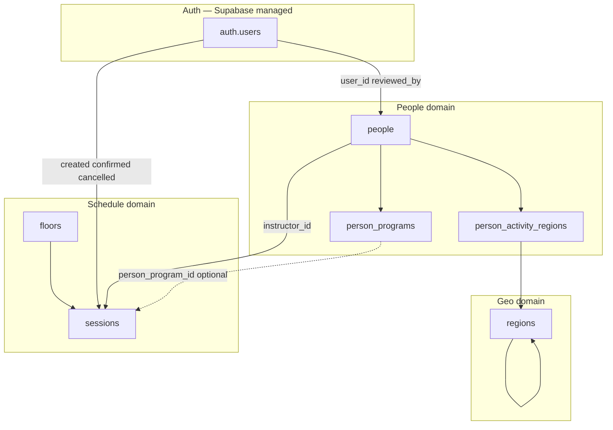
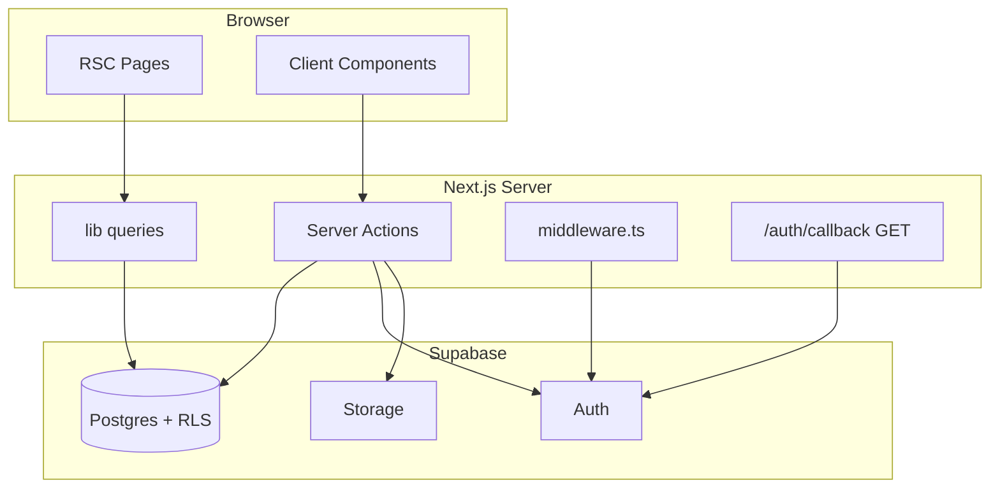
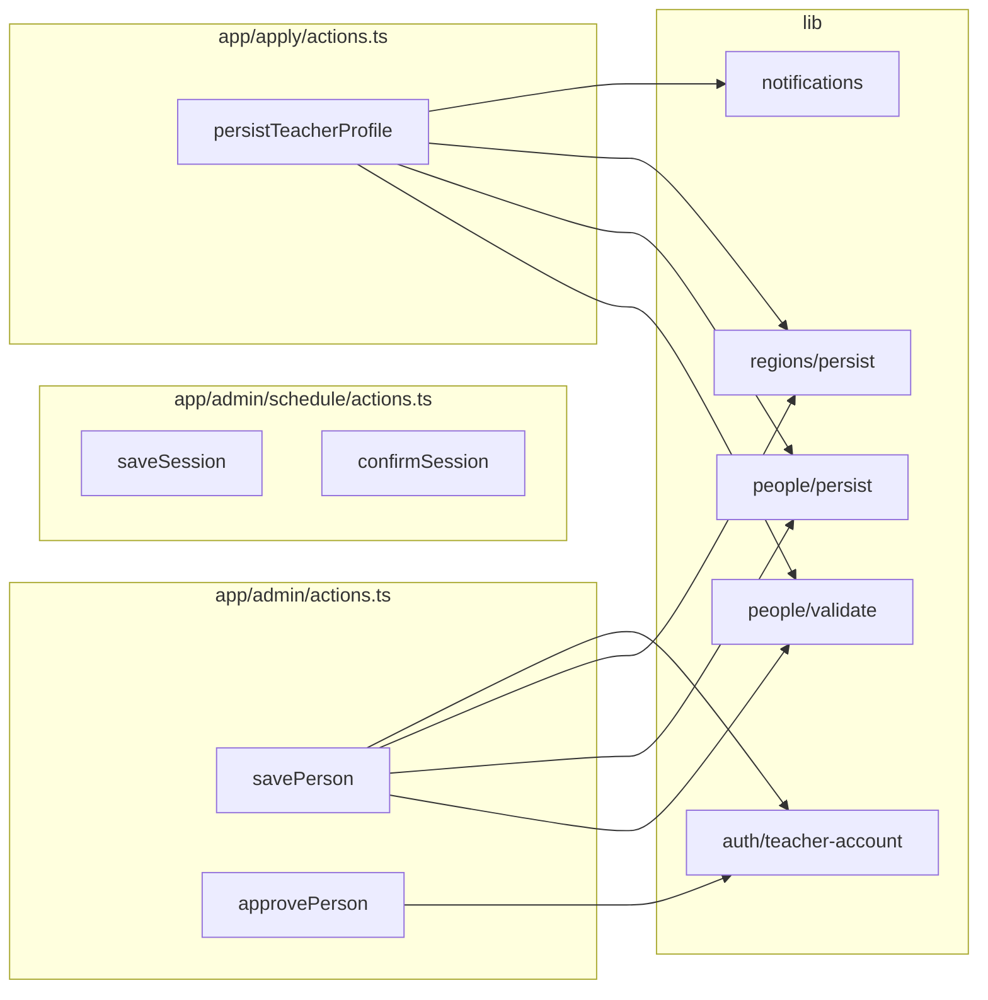

# Architecture Audit Log

점검 이력을 시간순으로 쌓는 문서입니다.  
스키마 상세: [database-schema.md](./database-schema.md) · ERD 요약: [database-erd.md](./database-erd.md) · 백엔드 맵: [backend-architecture.md](./backend-architecture.md)

---

## Audit #1 — 2026-06-16

**범위:** 전체 DB ERD, 데이터 아키텍처 비효율, Server Actions / `lib/` 백엔드 구조, 중복·결합도  
**환경:** `supabase/migrations/001`–`010` 기준, 프로덕션 Supabase 연동 코드

### Executive summary

| 구분 | 상태 | 핵심 |
|------|------|------|
| DB 정규화 | 양호 | People / Schedule / Regions 도메인 분리 명확 |
| 데이터 중복 | 주의 | 이메일 3중 저장, `path_keys` 이중 저장, `modalities` 레거시 |
| 쓰기 패턴 | 위험 | 프로그램 저장 시 DELETE→INSERT로 세션 FK 끊김 |
| Auth ↔ People | 취약 | 어드민/선생님 이메일 1:1 제약과 `syncTeacherAuthEmail` 충돌 |
| API 레이어 | 단순 | REST 거의 없음, Server Actions + Supabase 직접 호출 |
| 코드 중복 | 중간 | 폼·쿼리·auth 헬퍼 다수 반복 |

---

## 1. Full database ERD

### 1.1 Core entity diagram

```mermaid
erDiagram
    AUTH_USERS ||--o| PEOPLE : "user_id"
    AUTH_USERS ||--o{ PEOPLE : "reviewed_by"
    AUTH_USERS ||--o{ SESSIONS : "created_by"
    AUTH_USERS ||--o{ SESSIONS : "confirmed_by"
    AUTH_USERS ||--o{ SESSIONS : "cancelled_by"

    PEOPLE ||--|{ PERSON_PROGRAMS : "has"
    PEOPLE ||--o{ PERSON_ACTIVITY_REGIONS : "activity"
    PEOPLE ||--o{ SESSIONS : "instructs"

    REGIONS ||--o{ REGIONS : "parent_code"
    REGIONS ||--o{ PERSON_ACTIVITY_REGIONS : "region_code"

    FLOORS ||--|{ SESSIONS : "hosts"
    PERSON_PROGRAMS ||--o{ SESSIONS : "person_program_id"

    AUTH_USERS {
        uuid id PK
        text email UK
        jsonb app_metadata "role: teacher|admin"
        jsonb user_metadata "must_change_password"
    }

    PEOPLE {
        uuid id PK
        text slug UK
        person_kind kind
        text name_ko
        text name_en
        text role_ko
        text role_en
        text quote
        text_array modalities "legacy"
        text phone
        text email UK_lower
        text instagram
        text photo_path "→ person-photos"
        int sort_order
        boolean is_published
        uuid user_id FK "0..1"
        person_registration_status registration_status
        timestamptz submitted_at
        timestamptz reviewed_at
        uuid reviewed_by FK
        text rejection_reason
        timestamptz created_at
        timestamptz updated_at
    }

    PERSON_PROGRAMS {
        uuid id PK
        uuid person_id FK
        text title
        text description
        path_key_array path_keys
        int sort_order
        timestamptz created_at
    }

    REGIONS {
        text code PK
        text parent_code FK
        smallint level "1=sido 2=sigungu"
        text name_ko
        text name_en
        int sort_order
    }

    PERSON_ACTIVITY_REGIONS {
        uuid person_id FK
        smallint priority PK "1 or 2"
        text region_code FK
        timestamptz created_at
    }

    FLOORS {
        uuid id PK
        text slug UK
        smallint level UK "1-4"
        text name_ko
        text name_en
        int sort_order
    }

    SESSIONS {
        uuid id PK
        uuid floor_id FK
        uuid instructor_id FK
        uuid person_program_id FK "nullable"
        text title
        path_key_array path_keys "denormalized"
        timestamptz starts_at
        timestamptz ends_at
        int capacity
        int booked_count
        boolean is_published
        session_status status
        smallint slot_lane "0-1"
        timestamptz confirmed_at
        uuid confirmed_by FK
        uuid created_by FK
        text created_by_email "denormalized"
        timestamptz cancelled_at
        uuid cancelled_by FK
        text cancel_reason
        text_array image_paths "→ session-photos max 3"
        jsonb description_blocks
        timestamptz created_at
        timestamptz updated_at
    }
```

### 1.2 Storage (logical, no FK)

```mermaid
flowchart LR
    PEOPLE -->|photo_path| BP[(person-photos)]
    SESSIONS -->|image_paths[]| BS[(session-photos)]
```

### 1.3 Domain boundaries



### 1.4 Cardinality & delete rules

| From | To | Card. | ON DELETE | 비고 |
|------|-----|-------|-----------|------|
| `people.user_id` | `auth.users` | 0..1:1 | SET NULL | Auth 삭제 시 프로필 유지 |
| `people.email` | — | UNIQUE lower | — | Auth 이메일과 별도 관리 |
| `person_programs.person_id` | `people` | N:1 | CASCADE | |
| `person_activity_regions.person_id` | `people` | ≤2:1 | CASCADE | priority 1·2 |
| `sessions.instructor_id` | `people` | N:1 | RESTRICT | 강사 삭제 차단 |
| `sessions.person_program_id` | `person_programs` | N:0..1 | **SET NULL** | 프로그램 삭제 시 링크 소실 |
| `sessions.created_by` | `auth.users` | N:1 | — | FK만, 이메일은 별도 컬럼 |

---

## 2. Data architecture — inefficiencies & risks

### P0 — 데이터 무결성 / 운영 장애

| # | 이슈 | 위치 | 설명 |
|---|------|------|------|
| D-01 | **프로그램 저장 시 세션 FK 끊김** | `lib/people/persist.ts` → `savePersonPrograms` | 사람 저장마다 `person_programs` 전체 DELETE 후 INSERT. 기존 `sessions.person_program_id`는 `ON DELETE SET NULL`로 **즉시 해제**됨. 프로그램 UUID가 매 저장마다 바뀜. |
| D-02 | **이메일 3중 저장 + Auth 동기화 실패** | `people.email`, `auth.users.email`, `sessions.created_by_email` | 어드민이 `people.email` 변경 시 `syncTeacherAuthEmail`이 기존 teacher Auth UUID의 이메일만 변경 시도. **이미 다른 Auth 계정(어드민)이 쓰는 이메일**이면 저장 실패 (프로덕션에서 digest 에러로만 표시). |
| D-03 | **어드민/선생님 1이메일=1역할** | `provision-teacher-account.ts`, `middleware.ts` | `jueeyipida@gmail.com`(admin)과 `mudrasoil`(teacher) 분리 설계. 한 이메일에 두 역할 불가 → 운영 혼선 반복 가능. |

### P1 — 중복·비정규화 (의도적이나 관리 비용)

| # | 이슈 | 위치 | 설명 |
|---|------|------|------|
| D-04 | **`modalities` + `person_programs`** | `people.modalities`, `person_programs` | 저장 시 `modalities ← program titles` 동기화만 함. 읽기는 programs 우선, 없으면 modalities 폴백. **이중 소스** — 레거시 제거 전까지 혼란. |
| D-05 | **`sessions.path_keys` + `person_program_id`** | `sessions` | 프로그램 연결 시에도 세션에 `path_keys` 별도 저장. 프로그램 수정 후 **세션 철학 태그 불일치** 가능. |
| D-06 | **`created_by` + `created_by_email`** | `sessions` | Auth 사용자 삭제/이메일 변경 후에도 표시용 이메일 유지 목적. `created_by` FK와 **어긋날 수 있음** (수동 패치 시 발생). |
| D-07 | **지역 마스터 이중 소스** | `regions` 테이블 + `lib/regions/korea-regions.json` | `getRegionsForForms()` — DB 실패/빈 테이블 시 JSON 폴백. 시드 미적용 환경과 프로덕션 **코드 불일치** 가능. |

### P2 — 확장성 / 쿼리 비효율

| # | 이슈 | 위치 | 설명 |
|---|------|------|------|
| D-08 | **Auth 사용자 선형 검색** | `findUserByEmail`, `getAdminNotifyEmails` | `listUsers` 페이지네이션 전체 스캔. 사용자 수 적을 때는 OK, 수백+ 시 지연. |
| D-09 | **활동 지역 조회 N+1 가능** | `getPublishedPeople` | 사람마다 `activity_regions` + `region` join. 현재 규모에선 허용, 카드 수 증가 시 select 최적화 필요. |
| D-10 | **`booked_count` 미사용** | `sessions.booked_count` | 스키마만 존재, 예약 플로우 없음. UI/RLS와 무관한 dead column. |
| D-11 | **Storage 경로 무FK** | `photo_path`, `image_paths` | DB orphan 파일·고아 스토리지 객체 정리 배치 없음. 삭제 로직은 일부 액션에만 존재. |

---

## 3. Backend API & application structure

REST API는 사실상 없음. **Next.js Server Actions + Supabase JS**가 전체 백엔드.

### 3.1 Request flow



### 3.2 Entry points map

| 유형 | 경로 | 역할 |
|------|------|------|
| **Route Handler** | `GET /auth/callback` | Magic link `verifyOtp` / PKCE `exchangeCodeForSession` |
| **Middleware** | `middleware.ts` → `lib/supabase/middleware.ts` | 세션 갱신, 역할별 라우트 가드, auth callback |
| **Server Actions** | `app/admin/actions.ts` | People CRUD, 승인/반려, 선생님 계정 프로비저닝 |
| | `app/admin/schedule/actions.ts` | 세션 CRUD, confirm/unconfirm, 슬롯 경쟁 |
| | `app/apply/actions.ts` | 선생님 셀프등록, magic link, draft/submit |
| | `app/teacher/actions.ts` | 비밀번호 변경, 재발급, signOut |
| **Read queries** | `lib/people/queries.ts` | 퍼블릭/어드민 people |
| | `lib/schedule/queries.ts` | floors, sessions by day/range |
| | `lib/schedule/teacher-queries.ts` | 선생님 포털 upcoming |
| | `lib/regions/queries.ts` | 폼용 지역 목록 |
| **Service role** | `lib/supabase/service.ts` | Auth admin API, RLS 우회 (서버 전용) |

### 3.3 Server Actions dependency graph



### 3.4 Supabase client usage

| Client | 사용처 | RLS |
|--------|--------|-----|
| `server.ts` (cookie) | RSC, Server Actions | 적용 |
| `client.ts` (browser) | 사진 업로드 등 | 적용 |
| `service.ts` | Auth admin, 일부 lookup | **우회** |

---

## 4. Code duplication & structural inefficiencies

### P0

| # | 이슈 | 파일 | 권장 |
|---|------|------|------|
| C-01 | **이메일 변경 시 충돌 미처리** | `maybeProvisionOnAdminSave`, `syncTeacherAuthEmail` | 대상 이메일 Auth 존재 여부 선검사 + 명확한 에러 메시지. admin 계정이면 `people.user_id` 재연결 분기. |
| C-02 | **프로그램 upsert 없음** | `savePersonPrograms` | DELETE→INSERT 대신 id 기준 upsert 또는 diff. 세션 `person_program_id` 보존. |

### P1

| # | 이슈 | 파일 | 권장 |
|---|------|------|------|
| C-03 | **Person 폼 로직 중복** | `person-form.tsx`, `teacher-profile-form.tsx` | `uploadPhotoFile`, submit 플로우 공통 훅/유틸 추출 |
| C-04 | **persist 경로 이중** | `savePerson` vs `persistTeacherProfile` | 공통 `persistPersonCore()` + status/notify만 분기 |
| C-05 | **`normalizeRelation` 중복** | `lib/people/queries.ts`, `lib/schedule/queries.ts` | `lib/supabase/normalize-relation.ts` 단일화 |
| C-06 | **`requireAuth` 중복** | `admin/actions.ts`, `schedule/actions.ts`, `apply/actions.ts` | `lib/auth/require-session.ts` |
| C-07 | **Upcoming sessions 쿼리 중복** | `getUpcomingSessionsForInstructor`, `getUpcomingSessionsForTeacher` | instructorId vs user_id lookup만 인자로 통합 |
| C-08 | **signOut 3곳** | admin / apply / teacher actions | 공통 `signOut(redirectTo)` (낮은 우선순위) |

### P2

| # | 이슈 | 파일 | 권장 |
|---|------|------|------|
| C-09 | **프로덕션 Server Action 에러 마스킹** | Next.js prod build | `savePerson` 등에서 사용자Facing `Error` 메시지 유지 또는 `unstable_rethrow` 패턴 검토 |
| C-10 | **`getRegionsForForms` 반복 호출** | edit page + save action 각각 호출 | 페이지에서 regions props 전달, action에서만 재검증 |
| C-11 | **충돌 검사 앱 레이어** | `schedule/actions.ts` `fetchOverlappingSessions` | 세션 많아지면 DB exclusion constraint 또는 RPC 검토 |

---

## 5. RLS & security notes (audit)

| 영역 | 관찰 |
|------|------|
| Admin | `is_admin_user()` = role ≠ teacher. **role 미설정 = admin** — 의도적이나 신규 Auth 사용자 기본 admin 취급 주의. |
| Teacher | own row만 쓰기, `is_published` 강제 false. |
| Public | people/programs/regions published 조건 명확. sessions는 confirmed+published만. |
| Floors | `authenticated` 전체 허용 — teacher도 floors 쓰기 가능 (현재 UI 미사용). |
| Service role | 브라우저 미노출 확인됨. |

---

## 6. Recommended action backlog (from Audit #1)

상세 요건·설계·단계별 계획: **[refactoring-plan.md](./refactoring-plan.md)**

| 우선순위 | 항목 | 유형 | 예상 효과 |
|----------|------|------|-----------|
| 1 | `savePersonPrograms` upsert로 변경 | DB+코드 | 세션–프로그램 링크 유지 |
| 2 | 이메일 변경 분기 개선 (D-02/C-01) | 코드 | 어드민 저장 실패 제거 |
| 3 | `modalities` 컬럼 deprecate 계획 | DB | 이중 소스 제거 |
| 4 | `persistPersonCore` 추출 | 리팩터 | admin/apply 중복 감소 |
| 5 | regions JSON 폴백 제거 (시드 필수화) | 운영 | 환경 간 일관성 |
| 6 | `bookings` 테이블 설계 시 `booked_count` 연동 | 스키마 | dead column 해소 |

---

## 7. Changelog

| Date | Audit | Author | Notes |
|------|-------|--------|-------|
| 2026-06-16 | #1 | Cursor agent | Initial full ERD, data + backend duplication audit |
| 2026-06-16 | — | Team | **Email policy Option A (Strict) 확정** — [refactoring-plan.md § P0-B](./refactoring-plan.md) |
| 2026-06-16 | — | Cursor agent | **P0-A/P0-B 구현** — program upsert, `teacher-email.ts`, `PersonSaveResult` |
| 2026-06-16 | — | Cursor agent | **P1 구현** — `persist-person`, photo/form 공통화, auth/query 유틸 |

---

## Template for next audit

```markdown
## Audit #N — YYYY-MM-DD

**범위:**
**변경 since last audit:**

### Summary
### New / resolved findings
### Updated diagrams (if schema changed)
### Changelog row
```
