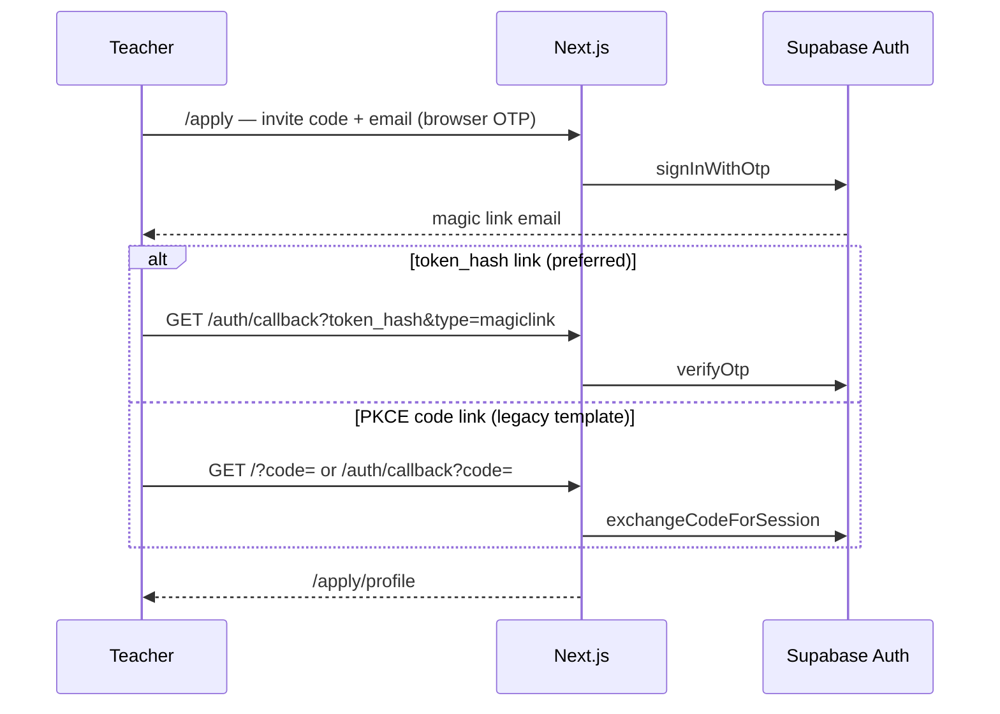
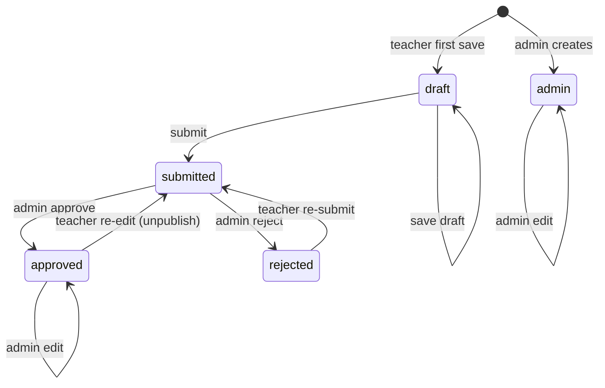
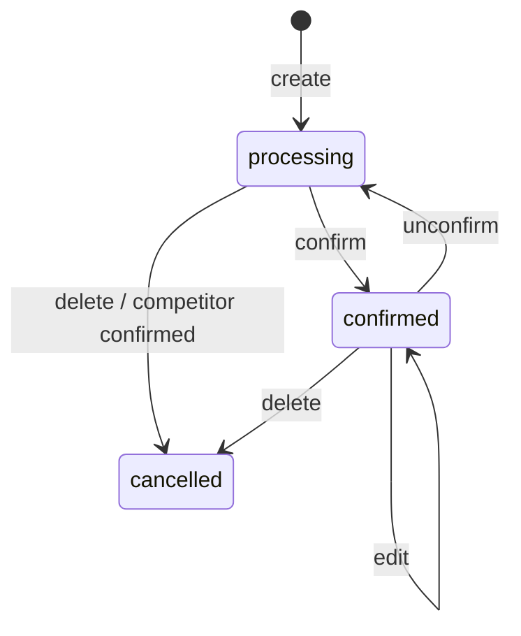

# The Wellness Korea — Backend Architecture & Core Logic

Last updated: 2026-06-16

Companion docs: [Site map](./site-map-and-flows.md) · [DB schema](./database-schema.md) · [ERD](./database-erd.md) · [Audit log](./architecture-audit-log.md) · [Refactoring plan](./refactoring-plan.md)

> 목적: 백엔드 및 비즈니스 로직 설계 추적 (신규 개발자 온보딩용)

---

## Technology stack

| Layer | Choice | Notes |
|-------|--------|-------|
| Framework | Next.js 16 App Router | RSC + Server Actions |
| Runtime | React 19 | |
| Language | TypeScript 5.7 | |
| Styling | Tailwind CSS 4 | `cn()` via clsx + tailwind-merge |
| UI primitives | shadcn, @base-ui/react, lucide-react | |
| Database | Supabase Postgres | RLS on all app tables |
| Auth | Supabase Auth | Admin: password · Teacher register: magic link · Teacher portal: password |
| File storage | Supabase Storage | `person-photos`, `session-photos` |
| Email | Resend REST API | Admin alerts; teacher credentials on provision/reissue |
| Chat | Slack incoming webhook | Optional |
| Analytics | @vercel/analytics | Production only |
| Deploy | Vercel | |

**Mutation pattern:** Server Actions (`"use server"`) in `app/admin/actions.ts`, `app/apply/actions.ts`, `app/admin/schedule/actions.ts`, `app/teacher/actions.ts`. No separate REST API layer for app CRUD.

---

## Supabase clients

| Module | When to use |
|--------|-------------|
| `lib/supabase/client.ts` | Browser components |
| `lib/supabase/server.ts` | Server Components, Actions, Route Handlers (cookie session) |
| `lib/supabase/service.ts` | Service role — `auth.admin.*`, bypass RLS (server only) |
| `lib/supabase/middleware.ts` | Session refresh, auth callback completion, route redirects |
| `lib/supabase/complete-auth-from-url.ts` | `verifyOtp` (token_hash) or `exchangeCodeForSession` (code) |

---

## Authentication & authorization

### Role model

| Role | How set | Access |
|------|---------|--------|
| **Admin** | Default; or `app_metadata.role = "admin"` | `/admin/*`, full RLS via `is_admin_user()` |
| **Teacher** | `ensureTeacherRole()` on first profile access; `app_metadata.role = teacher` on account provision | `/apply/profile/*` (registration), `/teacher/*` (portal), own `people` + `person_programs` via RLS |

DB helper `is_admin_user()`: JWT `app_metadata.role IS DISTINCT FROM 'teacher'` (unset = admin).

### Email policy (Option A — Strict) ✅

**확정일:** 2026-06-16 · 상세: [refactoring-plan.md § P0-B](./refactoring-plan.md)

| Rule | Detail |
|------|--------|
| One email, one role | An address is either **admin** or **teacher**, not both |
| `people.email` | Teacher **login + contact** (admin-only field on forms; not on public site) |
| Admin email reuse | Must **not** set `people.email` to an address already used by an admin Auth user |
| Typical setup | Personal email → `/admin/login` · Studio/teacher email → `/teacher/login` |
| On conflict | Reject save with explicit message; do not rename teacher Auth to an admin-owned email |

Provision path (`provisionTeacherAccount`) already blocks admin emails on **new** accounts; P0-B adds the same guard on **email change** via `maybeProvisionOnAdminSave`.

### Teacher portal password (design)

**Registration** still uses magic link on `/apply` (see below). **Ongoing access** uses email + password at `/teacher/login`.

| Trigger | Action |
|---------|--------|
| Admin saves person (`registration_status = admin`) with email, no `user_id` | `provisionTeacherAccount` + credentials email |
| Admin approves self-registered profile | Same (email required) |
| Admin “Reissue temporary password” | New random password + email |
| Teacher “임시 비밀번호 이메일로 받기” | Same for logged-in teacher |

Implementation: `lib/auth/provision-teacher-account.ts`, `lib/auth/teacher-account.ts`, `lib/notifications/teacher-credentials-email.ts`.

`user_metadata.must_change_password = true` on provision → middleware forces `/teacher/change-password` until cleared.

### Teacher magic link (registration only)

**Product requirement:** Teachers must log in from any device/browser — no “same Chrome only” rule.

Supabase supports two callback shapes; the app handles **both** in `lib/supabase/complete-auth-from-url.ts`:

| Callback | Example | Device | Server action |
|----------|---------|--------|---------------|
| **token_hash** (preferred) | `/auth/callback?token_hash=…&type=magiclink` | Any device | `verifyOtp()` — no PKCE cookie |
| **code** (PKCE fallback) | `/?code=…` or `/auth/callback?code=…` | Same browser that requested link | `exchangeCodeForSession()` |

**Request flow:** Browser client `signInWithOtp` on `/apply` (not Server Action) — PKCE cookies stored correctly when PKCE path is used.

**Complete flow:** Middleware or `/auth/callback` → session cookies → `/apply/profile` → `linkTeacherPerson` + `ensureTeacherRole`.

#### Supabase email template (required for any-device links)

Dashboard → **Authentication → Email Templates → Magic Link**

Replace the button/link `href` from default `{{ .ConfirmationURL }}` to:

```html
<a href="{{ .SiteURL }}/auth/callback?token_hash={{ .TokenHash }}&type=magiclink">
  로그인하기
</a>
```

- **Site URL** must be `https://www.thewellnesskorea.com`
- **Redirect URLs** must include `https://www.thewellnesskorea.com/auth/callback` (and localhost for dev)
- **SMTP:** Resend (`smtp.resend.com`, user `resend`, API key as password)

Until this template is updated, emails still use PKCE `code` links → same-browser limitation remains.

#### Known operational risks (industry-wide, not app-specific)

| Risk | Mitigation |
|------|------------|
| Corporate email scanners pre-click links | token_hash link consumed once; user requests fresh link; consider 6-digit OTP UI later |
| Link expired / clicked twice | Clear error + re-request on `/apply` |
| `www` vs apex cookie split | Use `www` consistently in Site URL + `NEXT_PUBLIC_SITE_URL` |

### Auth flows (diagram)



### Middleware guards (`middleware.ts`)

Matcher: `/`, `/admin/:path*`, `/apply/profile/:path*`, `/auth/callback`, `/teacher/:path*`

On `code` or `token_hash`+`type` in query: complete auth in middleware → redirect to `next` (default `/apply/profile`).

| Path | Unauthenticated | Teacher | Admin |
|------|-----------------|---------|-------|
| `/apply/profile/*` | → `/apply` | ✓ | ✓ |
| `/teacher/login` | ✓ | → `/teacher` or `/teacher/change-password` | → `/admin/people` |
| `/teacher/*` (not login) | → `/teacher/login` | ✓ (force change-password if flag) | → `/admin/people` |
| `/admin/login` | ✓ | → `/teacher` | → `/admin/people` |
| `/admin/*` (not login) | → `/admin/login` | → `/teacher` | ✓ |

Middleware complements but does not replace RLS.

---

## State transitions

### Person `registration_status`



| Transition | Side effects |
|------------|--------------|
| Teacher submit | `submitted_at` set; admins notified (email + Slack) |
| Admin approve | `reviewed_at/by` set; publish allowed |
| Admin reject | `is_published = false`, `rejection_reason` required |
| Approved → re-edit | `is_published = false`, status → `submitted`, re-notify |

### Session `status`



| Status | Grid | Publish |
|--------|------|---------|
| `processing` | 50%, `slot_lane` 0\|1, max 2/bucket | ✗ |
| `confirmed` | 100%, `slot_lane` 0 | ✓ if `is_published` |
| `cancelled` | hidden | ✗ |

| Transition | Side effects |
|------------|--------------|
| Confirm | `slot_lane → 0`, `confirmed_at/by` set; competing `processing` → `cancelled` (`competition_lost`) |
| Unconfirm | `is_published → false`, `confirmed_at/by` cleared, `slot_lane` reassigned; cancelled competitors **not** restored |

---

## Core business rules

### People

| Rule | Enforcement |
|------|-------------|
| Public homepage | `getPublishedPeople()`: `is_published` + status `admin`\|`approved` |
| Publish guard | `canPublishPerson()` — only `admin` or `approved` |
| Teacher cannot publish | `persistTeacherProfile` forces `is_published = false` |
| Email unique | DB index `lower(email)`; link-by-email on login |
| One person per auth user | partial unique on `user_id` |
| Delete blocked | if `sessions.instructor_id` references person |
| Programs optional | 0 programs allowed on submit |

### Teacher account linking (`linkTeacherPerson`)

1. Match `user_id` → return row
2. Match `email` (case-insensitive) → attach `user_id` (error if linked to another user)
3. No match → `null` (new row on first save)

### Schedule

| Rule | Enforcement |
|------|-------------|
| Hours | 06:00–24:00 KST |
| Paths | ≥1 `path_key` required |
| Images | max 3; bucket `session-photos` |
| Slot competition | max 2 `processing` per floor + overlapping time |
| Instructor overlap | blocked across non-cancelled sessions |
| Confirm | auto-cancel competing `processing` on same floor+time |
| Unconfirm | unpublish, clear `confirmed_*`, reassign `slot_lane`; does not restore cancelled competitors |
| Public read | RLS: `is_published AND status = 'confirmed'` |

### Notifications (`notifyAdminProfileSubmitted`)

- Trigger: new submit or re-submit (incl. post-approval edit)
- Recipients: `getAdminNotifyEmails()` — all Auth users where `role !== "teacher"`
- Channels: Resend + optional Slack; failures silent
- Requires: `RESEND_API_KEY`, `NOTIFY_FROM_EMAIL`, `SUPABASE_SERVICE_ROLE_KEY`

### Cache revalidation

| Action | `revalidatePath` |
|--------|------------------|
| Person save/publish | `/admin/people`, edit page, `/` if published |
| Session save/publish | `/admin/schedule`, `/` if published |

---

## Server Actions map

### `app/admin/actions.ts`

| Action | Purpose |
|--------|---------|
| `signOut` | Admin session end |
| `savePerson` / `createPerson` / `updatePerson` | Person + programs CRUD |
| `updatePersonPhotoPath` | Photo path update + old file cleanup |
| `approvePerson` | `registration_status → approved`; provision Auth + temp password email |
| `reissueTeacherPassword` | New random password + email |
| `rejectPerson` | `→ rejected`, unpublish, reason required |
| `deletePerson` | Delete if no sessions reference instructor |

### `app/apply/actions.ts`

| Action | Purpose |
|--------|---------|
| `requestTeacherMagicLink` | Validate invite code + send OTP |
| `getTeacherPerson` | Auth + `linkTeacherPerson` |
| `saveTeacherProfileDraft` | `draft` status |
| `submitTeacherProfile` | `submitted` + notify |
| `signOutTeacher` | Teacher session end |

### `app/teacher/actions.ts`

| Action | Purpose |
|--------|---------|
| `teacherSignOut` | Teacher portal session end |
| `changeTeacherPassword` | Verify current + set new; clear `must_change_password` |
| `requestTeacherPasswordReissue` | Random temp password + email to logged-in teacher |

### `app/admin/schedule/actions.ts`

| Action | Purpose |
|--------|---------|
| `saveSession` | Create/update; slot lane assignment; image cleanup |
| `confirmSession` | Confirm + cancel competitors |
| `unconfirmSession` | Revert to processing + unpublish |
| `duplicateSession` | Copy to new slot as `processing` |
| `deleteSession` | Soft cancel |

---

## lib/ function map

### `lib/auth/`

| Export | Role |
|--------|------|
| `generateTempPassword` | Random password for provision/reissue |
| `mustChangePassword` | Edge-safe middleware check for `user_metadata.must_change_password` |
| `provisionTeacherAccount` | Create/update Auth user, set `role=teacher`, `must_change_password` |
| `syncTeacherAuthEmail` | Update Auth email when admin edits person email (`lib/auth/teacher-email.ts`) |
| `requireAdminSession`, `requireTeacherSession` | Auth session guards (`require-session.ts`) |
| `assertTeacherEmailAvailable`, `resolveEmailChangeOnAdminSave` | Option A email policy on admin save |
| `clearMustChangePassword` | Service-role metadata cleanup after password change |
| `provisionAndEmailTeacherAccount`, `maybeProvisionOnAdminSave`, `linkPersonToAuthUser` | Orchestrate people row + email |
| `mustChangePassword`, `getTeacherPersonByUserId` | Middleware + layout helpers |

### `lib/apply/`

| Export | Role |
|--------|------|
| `teacherApplyCode`, `siteOrigin`, `applyProfileUrl` | Env-based config |
| `ensureTeacherRole` | Set `app_metadata.role = teacher` |
| `linkTeacherPerson` | Auth user ↔ `people` row |

### `lib/people/`

| Export | Role |
|--------|------|
| `getPublishedPeople`, `getAllPeopleAdmin`, `getPersonById` | Queries |
| `persistPerson` | Shared admin/teacher profile save (`persist-person.ts`) |
| `emptyPersonInput`, `personInputFromPerson` | Form state (`form-state.ts`) |
| `uploadPersonPhoto`, `validatePersonPhotoFile` | Client photo upload (`photo-upload.ts`) |
| `validatePersonInput` | Form validation |
| `personRowFromInput`, `savePersonPrograms`, `resolvePersonSlug`, `uniqueSlug` | Persist |
| `isSelfRegistered(status, userId?)` | Registration helpers; legacy `approved` without `user_id` excluded |
| `slugify`, `getPersonPhotoUrl`, `toPersonCard`, `isValidEmail`, … | Display/utils |

### `lib/schedule/`

| Export | Role |
|--------|------|
| `getFloors`, `getSessionsForDay`, `getSessionsForRange` | Queries |
| `getUpcomingSessions`, `getUpcomingSessionsForInstructor` | Upcoming confirmed sessions |
| `getUpcomingSessionsForTeacher` | Teacher portal wrapper |
| `toSessionWithRelations` | Normalize Supabase relation arrays |
| `formatWeekRangeLabel`, `formatCompactWeekRange`, `listWeeksOverlappingMonth` | Period labels + week picker |
| `toKstIso`, `sessionsOverlap`, `isWithinOperatingHours`, week/month helpers | KST time math |
| `layoutWidthForSession`, `layoutLeftForSession` | Grid 50%/100% layout |
| `sessionStatusLabel`, ribbon classes | UI status |
| `getSessionPhotoUrl`, `normalizeDescriptionBlocks`, storage path helpers | Images/content |

### `lib/notifications/`

| Export | Role |
|--------|------|
| `getAdminNotifyEmails` | Paginate Auth users, filter admins |
| `notifyAdminProfileSubmitted`, `applyLinkForTeachers` | Admin alert dispatch |
| `sendTeacherCredentialsEmail` | Welcome / reissue temp password to teacher |

### `lib/paths/`

| Export | Role |
|--------|------|
| `PATHS`, `PATH_OPTIONS`, `pathLabelKo` | Static philosophy path metadata |

### `lib/supabase/`

| Export | Role |
|--------|------|
| `createClient` (client/server/service) | Supabase instances |
| `normalizeRelation` | Join array helper (`normalize-relation.ts`) |
| `updateSession` | Middleware auth |
| `isSupabaseConfigured` | Env guard |

---

## Security summary

- RLS on `people`, `person_programs`, `floors`, `sessions`
- Service role never exposed to browser
- Teacher RLS: own `people` + `person_programs`; read own `sessions` (confirmed + published only); cannot set `is_published`
- Admin RLS: `is_admin_user()` on people/programs
- Storage: public read; authenticated write per bucket policy

---

## Architecture audits

점검 이력·비효율 분석·중복 목록: [architecture-audit-log.md](./architecture-audit-log.md)  
개선 계획·요건·단계: [refactoring-plan.md](./refactoring-plan.md)  
(2026-06-16 Audit #1: 프로그램 DELETE→INSERT FK 이슈, 이메일 3중 저장, Server Actions 중복 등)

---

## Not yet implemented

- Public homepage schedule from live `sessions`
- `booked_count` increment / booking flow
- Notify processing-session creators on auto-cancel
- Resend domain verification for production
- Teacher forgot-password page (unauthenticated)
- Teacher profile edit in `/teacher` (still via `/apply/profile` when needed)
