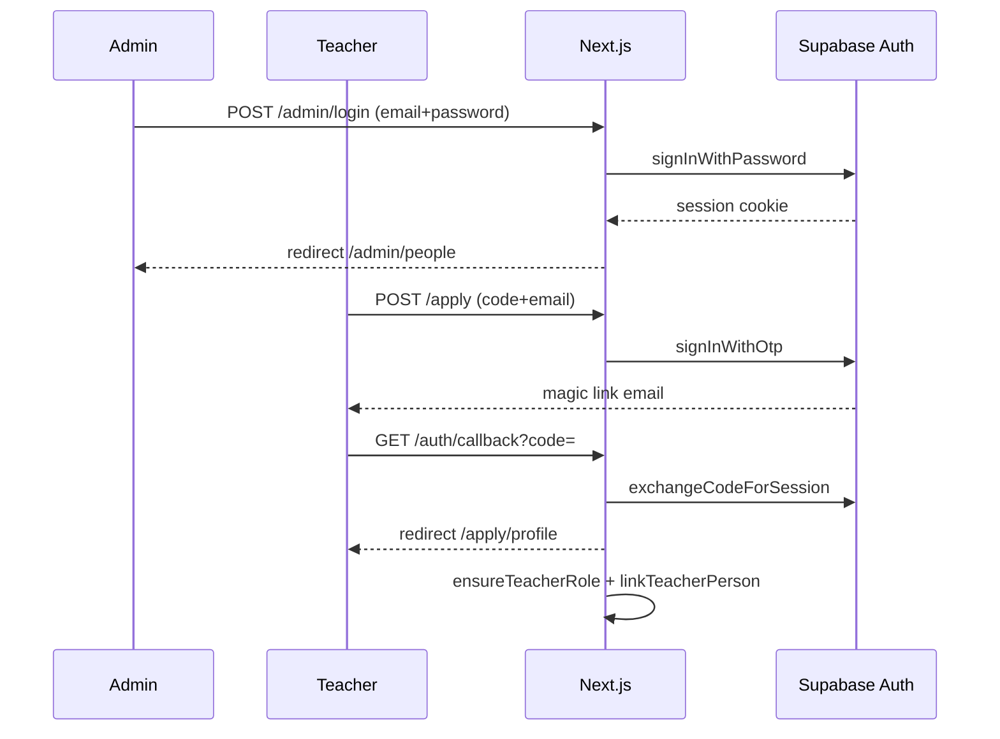
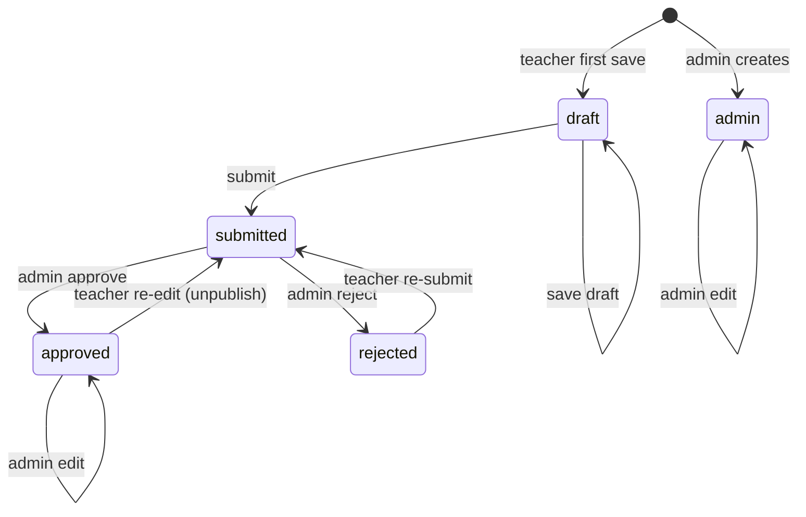
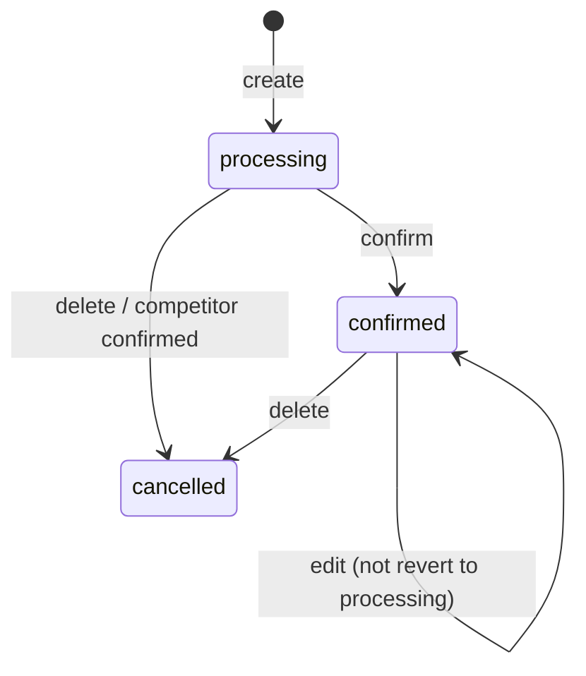

# The Wellness Korea — Backend Architecture & Core Logic

Last updated: 2026-06-16

Companion docs: [Site map](./site-map-and-flows.md) · [DB schema](./database-schema.md) · [ERD](./database-erd.md)

> 목적: 백엔드 및 비즈니스 로직 설계 추적 (신규 개발자 온보딩용)

---

## Technology stack

| Layer | Choice | Notes |
|-------|--------|-------|
| Framework | Next.js 16 App Router | RSC + Server Actions |
| Runtime | React 19 | |
| Language | TypeScript 5.7 | |
| Styling | Tailwind CSS 4 | `cn()` via clsx + tailwind-merge |
| UI primitives | shadcn, @base-ui/react, lucide-react | |
| Database | Supabase Postgres | RLS on all app tables |
| Auth | Supabase Auth | Admin: password · Teacher: magic link OTP |
| File storage | Supabase Storage | `person-photos`, `session-photos` |
| Email | Resend REST API | Admin alerts on profile submit |
| Chat | Slack incoming webhook | Optional |
| Analytics | @vercel/analytics | Production only |
| Deploy | Vercel | |

**Mutation pattern:** Server Actions (`"use server"`) in `app/admin/actions.ts`, `app/apply/actions.ts`, `app/admin/schedule/actions.ts`. No separate REST API layer for app CRUD.

---

## Supabase clients

| Module | When to use |
|--------|-------------|
| `lib/supabase/client.ts` | Browser components |
| `lib/supabase/server.ts` | Server Components, Actions, Route Handlers (cookie session) |
| `lib/supabase/service.ts` | Service role — `auth.admin.*`, bypass RLS (server only) |
| `lib/supabase/middleware.ts` | Session refresh + route redirects |

---

## Authentication & authorization

### Role model

| Role | How set | Access |
|------|---------|--------|
| **Admin** | Default; or `app_metadata.role = "admin"` | `/admin/*`, full RLS via `is_admin_user()` |
| **Teacher** | `ensureTeacherRole()` on first profile access | `/apply/profile/*`, own `people` + `person_programs` via RLS |

DB helper `is_admin_user()`: JWT `app_metadata.role IS DISTINCT FROM 'teacher'` (unset = admin).

### Auth flows

### Middleware guards (`middleware.ts`)

Matcher: `/admin/:path*`, `/apply/profile/:path*`, `/auth/callback`

| Path | Unauthenticated | Teacher | Admin |
|------|-----------------|---------|-------|
| `/apply/profile/*` | → `/apply` | ✓ | ✓ |
| `/admin/login` | ✓ | → `/apply/profile` | → `/admin/people` |
| `/admin/*` (not login) | → `/admin/login` | → `/apply/profile` | ✓ |

Middleware complements but does not replace RLS.

---

## State transitions

### Person `registration_status`

| Transition | Side effects |
|------------|--------------|
| Teacher submit | `submitted_at` set; admins notified (email + Slack) |
| Admin approve | `reviewed_at/by` set; publish allowed |
| Admin reject | `is_published = false`, `rejection_reason` required |
| Approved → re-edit | `is_published = false`, status → `submitted`, re-notify |

### Session `status`

| Status | Grid | Publish |
|--------|------|---------|
| `processing` | 50%, `slot_lane` 0\|1, max 2/bucket | ✗ |
| `confirmed` | 100%, `slot_lane` 0 | ✓ if `is_published` |
| `cancelled` | hidden | ✗ |

---

## Core business rules

### People

| Rule | Enforcement |
|------|-------------|
| Public homepage | `getPublishedPeople()`: `is_published` + status `admin`\|`approved` |
| Publish guard | `canPublishPerson()` — only `admin` or `approved` |
| Teacher cannot publish | `persistTeacherProfile` forces `is_published = false` |
| Email unique | DB index `lower(email)`; link-by-email on login |
| One person per auth user | partial unique on `user_id` |
| Delete blocked | if `sessions.instructor_id` references person |
| Programs optional | 0 programs allowed on submit |

### Teacher account linking (`linkTeacherPerson`)

1. Match `user_id` → return row
2. Match `email` (case-insensitive) → attach `user_id` (error if linked to another user)
3. No match → `null` (new row on first save)

### Schedule

| Rule | Enforcement |
|------|-------------|
| Hours | 06:00–24:00 KST |
| Paths | ≥1 `path_key` required |
| Images | max 3; bucket `session-photos` |
| Slot competition | max 2 `processing` per floor + overlapping time |
| Instructor overlap | blocked across non-cancelled sessions |
| Confirm | auto-cancel competing `processing` on same floor+time |
| Public read | RLS: `is_published AND status = 'confirmed'` |

### Notifications (`notifyAdminProfileSubmitted`)

- Trigger: new submit or re-submit (incl. post-approval edit)
- Recipients: `getAdminNotifyEmails()` — all Auth users where `role !== "teacher"`
- Channels: Resend + optional Slack; failures silent
- Requires: `RESEND_API_KEY`, `NOTIFY_FROM_EMAIL`, `SUPABASE_SERVICE_ROLE_KEY`

### Cache revalidation

| Action | `revalidatePath` |
|--------|------------------|
| Person save/publish | `/admin/people`, edit page, `/` if published |
| Session save/publish | `/admin/schedule`, `/` if published |

---

## Server Actions map

### `app/admin/actions.ts`

| Action | Purpose |
|--------|---------|
| `signOut` | Admin session end |
| `savePerson` / `createPerson` / `updatePerson` | Person + programs CRUD |
| `updatePersonPhotoPath` | Photo path update + old file cleanup |
| `approvePerson` | `registration_status → approved` |
| `rejectPerson` | `→ rejected`, unpublish, reason required |
| `deletePerson` | Delete if no sessions reference instructor |

### `app/apply/actions.ts`

| Action | Purpose |
|--------|---------|
| `requestTeacherMagicLink` | Validate invite code + send OTP |
| `getTeacherPerson` | Auth + `linkTeacherPerson` |
| `saveTeacherProfileDraft` | `draft` status |
| `submitTeacherProfile` | `submitted` + notify |
| `signOutTeacher` | Teacher session end |

### `app/admin/schedule/actions.ts`

| Action | Purpose |
|--------|---------|
| `saveSession` | Create/update; slot lane assignment; image cleanup |
| `confirmSession` | Confirm + cancel competitors |
| `duplicateSession` | Copy to new slot as `processing` |
| `deleteSession` | Soft cancel |

---

## lib/ function map

### `lib/apply/`

| Export | Role |
|--------|------|
| `teacherApplyCode`, `siteOrigin`, `applyProfileUrl` | Env-based config |
| `ensureTeacherRole` | Set `app_metadata.role = teacher` |
| `linkTeacherPerson` | Auth user ↔ `people` row |

### `lib/people/`

| Export | Role |
|--------|------|
| `getPublishedPeople`, `getAllPeopleAdmin`, `getPersonById` | Queries |
| `validatePersonInput` | Form validation |
| `personRowFromInput`, `savePersonPrograms`, `resolvePersonSlug`, `uniqueSlug` | Persist |
| `canPublishPerson`, `isSelfRegistered`, status labels/badges | Registration helpers |
| `slugify`, `getPersonPhotoUrl`, `toPersonCard`, `isValidEmail`, … | Display/utils |

### `lib/schedule/`

| Export | Role |
|--------|------|
| `getFloors`, `getSessionsForDay`, `getSessionsForRange` | Queries |
| `toKstIso`, `sessionsOverlap`, `isWithinOperatingHours`, week/month helpers | KST time math |
| `layoutWidthForSession`, `layoutLeftForSession` | Grid 50%/100% layout |
| `sessionStatusLabel`, ribbon classes | UI status |
| `getSessionPhotoUrl`, `normalizeDescriptionBlocks`, storage path helpers | Images/content |

### `lib/notifications/`

| Export | Role |
|--------|------|
| `getAdminNotifyEmails` | Paginate Auth users, filter admins |
| `notifyAdminProfileSubmitted`, `applyLinkForTeachers` | Alert dispatch |

### `lib/paths/`

| Export | Role |
|--------|------|
| `PATHS`, `PATH_OPTIONS`, `pathLabelKo` | Static philosophy path metadata |

### `lib/supabase/`

| Export | Role |
|--------|------|
| `createClient` (client/server/service) | Supabase instances |
| `updateSession` | Middleware auth |
| `isSupabaseConfigured` | Env guard |

---

## Security summary

- RLS on `people`, `person_programs`, `floors`, `sessions`
- Service role never exposed to browser
- Teacher RLS: own row only; cannot set `is_published`
- Admin RLS: `is_admin_user()` on people/programs
- Storage: public read; authenticated write per bucket policy

---

## Not yet implemented

- Public homepage schedule from live `sessions`
- `booked_count` increment / booking flow
- Notify processing-session creators on auto-cancel
- Resend domain verification for production
