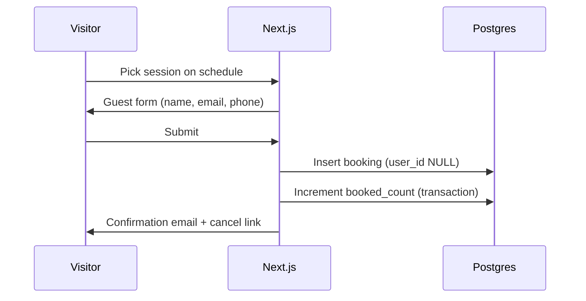
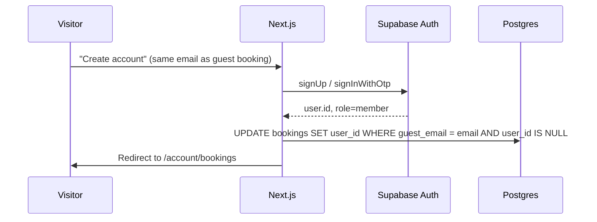

# Booking & Member Auth — Requirements

Last updated: 2026-06-18

Companion: [Site map](./site-map-and-flows.md) · [DB schema](./database-schema.md) · [ERD](./database-erd.md) · [Backend](./backend-architecture.md) · [Multi-experience](./multi-venue-requirements.md)

> Participant class booking for public visitors. **Hybrid model (C):** guest first, optional account, then logged-in booking.

---

## 1. Product decision (confirmed)

| # | Decision |
|---|----------|
| B-01 | **Hybrid booking** — guest can book without an account |
| B-02 | After booking, user may **create an account** to attach past guest bookings |
| B-03 | Logged-in members book with `user_id`; guest fields optional snapshot |
| B-04 | **v1 payment:** on-site / no online payment (Terms-aligned) |
| B-05 | Member accounts use **Supabase Auth** — separate role from admin / teacher |

---

## 2. Current state (gap)

| Area | Today |
|------|--------|
| Homepage schedule | Live `sessions` from DB (`confirmed` + `published`), filtered by `experience_id` |
| `sessions.booked_count` | Column exists; **never incremented** |
| `bookings` table | **Does not exist** |
| Public visitor auth | **Does not exist** (only admin + teacher) |
| Closing CTA “Reserve your visit” | `href="#"` — not wired |

**Prerequisite:** Public schedule from live `sessions` (confirmed + published) before booking is meaningful.

---

## 3. Auth model — three roles on one Supabase Auth

All identities live in `auth.users`. **Role** in `app_metadata.role` (or equivalent) gates access.

| Role | `app_metadata.role` | Login | Provisioned by |
|------|---------------------|-------|----------------|
| **Admin** | unset or `admin` | `/admin/login` | manual / default |
| **Teacher** | `teacher` | `/teacher/login` | Admin (`provisionTeacherAccount`) |
| **Member** | `member` | `/login` (planned) | **Self-signup** or post-booking “create account” |

### Email policy (extends Option A — Strict)

| Rule | Detail |
|------|--------|
| One email, one role | Same address cannot be admin, teacher, and member interchangeably |
| Teacher provision | Already blocks admin emails |
| Member signup | Must reject emails owned by admin or teacher Auth users |
| Teacher provision | Must reject emails already registered as `member` |

Implementation: mirror `lib/auth/teacher-email.ts` → `member-email.ts` (or shared `assertEmailAvailableForRole`).

### Member vs `people` table

| | Teacher | Member |
|---|---------|--------|
| DB profile | `people` row + `user_id` | **No `people` row** (unless later “guide as member” edge case) |
| Profile data | `people.*` | `members` table or `bookings` guest snapshot + Auth email |

---

## 4. Booking flows

### 4.1 Guest booking (v1 path)

| ID | Requirement |
|----|-------------|
| G-01 | Required: `guest_name`, `guest_email`; optional `guest_phone` |
| G-02 | `user_id` NULL on guest bookings |
| G-03 | Enforce `booked_count < capacity` at insert (DB or RPC) |
| G-04 | One active booking per email per session (configurable duplicate rule) |
| G-05 | Confirmation + cancellation via **signed token** or booking id + email verify (no login) |
| G-06 | Email via Resend (existing stack) |

### 4.2 Create account after guest booking

| ID | Requirement |
|----|-------------|
| M-01 | `supabase.auth.signUp` or magic link — **not** admin `createUser` (unlike teacher) |
| M-02 | Server sets `app_metadata.role = member` after signup (service role / hook) |
| M-03 | Link guest bookings: same normalized email → set `user_id` |
| M-04 | Optional: prompt on confirmation page (“Save bookings to an account”) |

### 4.3 Logged-in member booking

| ID | Requirement |
|----|-------------|
| L-01 | `/login` → session cookie |
| L-02 | Book with `user_id`; prefill name/email from `members` or last booking |
| L-03 | `/account` or `/account/bookings` — list + cancel own bookings |
| L-04 | RLS: member reads/updates only rows where `bookings.user_id = auth.uid()` |

---

## 5. Data model (migration `013_bookings.sql`)

### `booking_status` enum

| Value | Meaning |
|-------|---------|
| `confirmed` | Active reservation |
| `cancelled` | User or admin cancelled |
| `no_show` | (optional, admin) |

### `bookings`

| Column | Type | Notes |
|--------|------|--------|
| `id` | uuid | PK |
| `session_id` | uuid | FK → `sessions`, RESTRICT |
| `user_id` | uuid | FK → `auth.users`, nullable — NULL = guest |
| `guest_name` | text | Required if `user_id` NULL; snapshot if logged in |
| `guest_email` | text | Normalized lowercase; required |
| `guest_phone` | text | nullable |
| `status` | booking_status | default `confirmed` |
| `cancelled_at` | timestamptz | nullable |
| `cancel_token` | text | nullable, unique — guest cancel without login |
| `created_at`, `updated_at` | timestamptz | |

**Indexes:** `(session_id)`, `(user_id)`, `(guest_email)`, `(session_id, guest_email)` unique for active bookings if one-per-session rule.

### `members` (optional but recommended)

| Column | Type | Notes |
|--------|------|--------|
| `id` | uuid | PK = `auth.users.id` |
| `name` | text | display name |
| `phone` | text | nullable |
| `locale` | text | `en` / `ko` optional |
| `created_at`, `updated_at` | timestamptz | |

Created on first signup or first linked booking.

### `sessions.booked_count`

| Rule | Detail |
|------|--------|
| Source of truth | Prefer **count of `confirmed` bookings** OR maintain counter via trigger |
| Increment | On booking confirm |
| Decrement | On cancel (if was confirmed) |
| Cap | `booked_count <= capacity` always |

Recommendation: **trigger or RPC** `create_booking()` in one transaction to avoid race overbooking.

---

## 6. RLS (sketch)

| Table | Policy |
|-------|--------|
| `bookings` | Member SELECT/UPDATE own (`user_id = auth.uid()`) |
| `bookings` | Admin ALL via `is_admin_user()` |
| `bookings` | INSERT: service role or RPC from Server Action (guest has no JWT) |
| `members` | Member read/update own row |
| `sessions` | Public read unchanged: `is_published AND status = confirmed` |

Guest insert likely goes through **Server Action + service role** or **security definer RPC** — not direct anon insert.

---

## 7. Public UI (planned routes)

| URL | Purpose |
|-----|---------|
| `/` schedule section | Live sessions + “Book” → modal or `/book/[sessionId]` |
| `/book/[sessionId]` | Guest form + optional login CTA |
| `/book/confirm` | Success + “create account” prompt |
| `/book/cancel/[token]` | Guest cancel |
| `/login` | Member email + password (or magic link) |
| `/signup` | Member registration |
| `/account` | Profile shell |
| `/account/bookings` | My reservations |

Navbar: optional “Log in” when member auth ships (not required for guest v1).

---

## 8. Admin (planned)

| ID | Requirement |
|----|-------------|
| A-01 | Session detail: list bookings, manual cancel |
| A-02 | Export or filter by session / date |
| A-03 | Adjust capacity / block booking (session cancel already exists) |

Can defer full admin booking UI until after public guest path works.

---

## 9. Business rules (inherit + extend)

From existing schedule logic ([backend-architecture.md](./backend-architecture.md)):

| Rule | Booking impact |
|------|----------------|
| Only `status = confirmed` + `is_published` sessions bookable | Filter public query |
| `capacity > 0` | Reject when full |
| Instructor overlap | Already on session creation; booking does not add new sessions |
| Experience / floor | Session already tied to `experience_id` via admin |

**New:**

| Rule | Detail |
|------|--------|
| Booking window | e.g. not after `starts_at`, optional min notice |
| Cancellation window | e.g. free cancel until N hours before (product TBD) |
| Waitlist | Out of scope v1 |

---

## 10. Implementation phases

| Phase | Scope | Depends on |
|-------|--------|------------|
| **B0** | This doc + schema design review | — |
| **B1** | Public schedule from DB (replace mock) | **Done** |
| **B2** | `013_bookings.sql` + RPC/trigger for `booked_count` | **Done** |
| **B3** | Guest book flow + confirmation/cancel email | **Done** |
| **B4** | Member signup/login (`role: member`) + link guest bookings | **Done** |
| **B5** | `/account/bookings` + member book while logged in | **Done** (core) |
| **B6** | Admin booking list / manual cancel | **Done** |
| **B7** | Online payment (Stripe etc.) | Out of v1 |

**Journal** and **Admin experience picker** can run in parallel; booking **requires B1** first.

---

## 11. Out of scope (v1)

- Online payment / refunds automation
- Waitlist / lottery
- Multi-seat booking (one booking = one seat v1)
- Teacher or admin acting as participant on same email without role conflict policy
- Push notifications

---

## 12. Changelog

| Date | Notes |
|------|-------|
| 2026-06-18 | B6 admin `/admin/bookings`, session dialog reservations, CSV export, admin cancel |
| 2026-06-18 | B4–B5 member magic-link auth, guest booking link, `/account/bookings`, logged-in book |
| 2026-06-18 | B3 guest booking: `/book/[sessionId]`, confirm/cancel pages, Resend emails, schedule Book links |
| 2026-06-18 | B2 `013_bookings.sql`: `bookings`, `members`, `create_booking` / cancel RPCs, `booked_count` sync |
| 2026-06-18 | B1 public schedule from live `sessions` (experience-filtered, KST week) |
