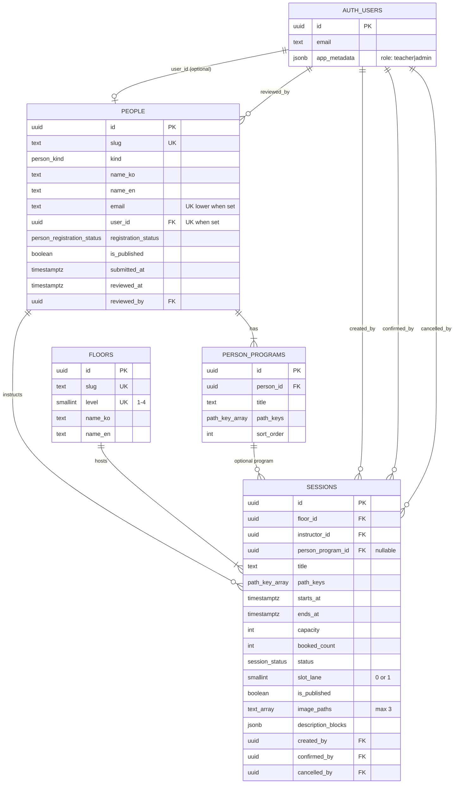
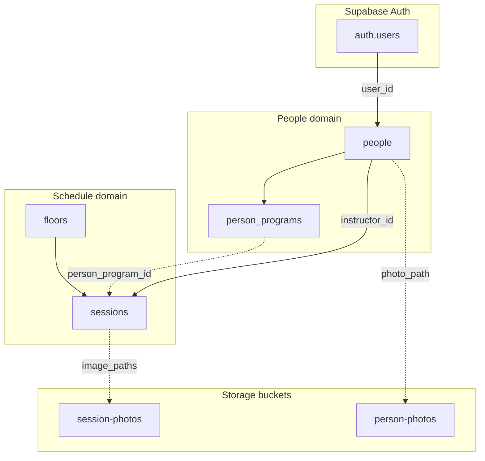
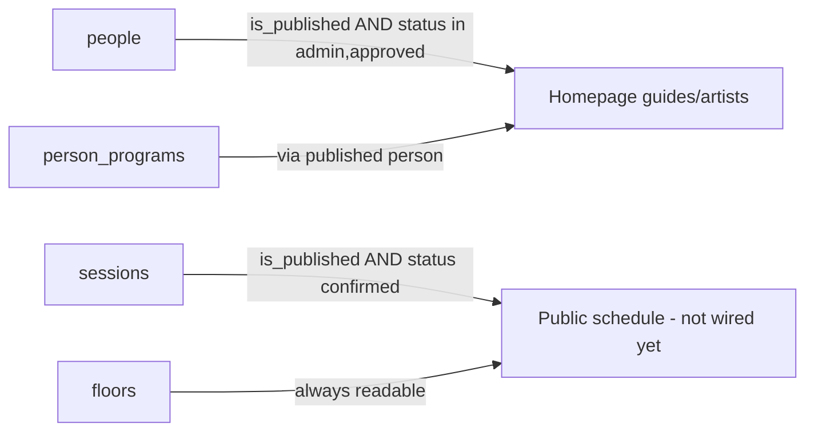

# The Wellness Korea — Database ERD

Last updated: 2026-06-16

Companion: [Schema reference](./database-schema.md) · [Backend logic](./backend-architecture.md)

---

## Entity relationship diagram

---

## Relationship summary

| From | To | Cardinality | ON DELETE | Notes |
|------|-----|-------------|-----------|-------|
| `people.user_id` | `auth.users` | 0..1 : 1 | SET NULL | One auth user → at most one person |
| `people.reviewed_by` | `auth.users` | N : 1 | — | Admin who approved/rejected |
| `person_programs.person_id` | `people` | N : 1 | CASCADE | Programs deleted with person |
| `sessions.instructor_id` | `people` | N : 1 | RESTRICT | Cannot delete person with sessions |
| `sessions.floor_id` | `floors` | N : 1 | RESTRICT | |
| `sessions.person_program_id` | `person_programs` | N : 0..1 | SET NULL | Optional link to specific program |
| `sessions.created_by` | `auth.users` | N : 1 | — | Admin who created |
| `sessions.confirmed_by` | `auth.users` | N : 1 | — | Admin who confirmed |
| `sessions.cancelled_by` | `auth.users` | N : 1 | — | Admin or system cancel |

---

## Domain groupings

---

## Enum usage map

| Enum | Used in |
|------|---------|
| `person_kind` | `people.kind` |
| `path_key` | `person_programs.path_keys`, `sessions.path_keys` |
| `person_registration_status` | `people.registration_status` |
| `session_status` | `sessions.status` |

---

## Key business constraints (not FK)

| Constraint | Tables | Rule |
|------------|--------|------|
| Email uniqueness | `people` | `UNIQUE (lower(email))` where email not empty |
| Auth link uniqueness | `people` | `UNIQUE (user_id)` where not null |
| Session time | `sessions` | `ends_at > starts_at` |
| Session images | `sessions` | `cardinality(image_paths) <= 3` |
| Slot lane | `sessions` | `slot_lane BETWEEN 0 AND 1` |
| Floor level | `floors` | `level BETWEEN 1 AND 4` |
| Capacity | `sessions` | `capacity > 0`, `booked_count >= 0` |

---

## Public visibility (read path)

---

## Storage (logical, not relational FK)

| Entity | Column | Bucket |
|--------|--------|--------|
| Person | `photo_path` | `person-photos` |
| Session | `image_paths[]` | `session-photos` |

Paths are opaque strings; no DB FK to `storage.objects`.
