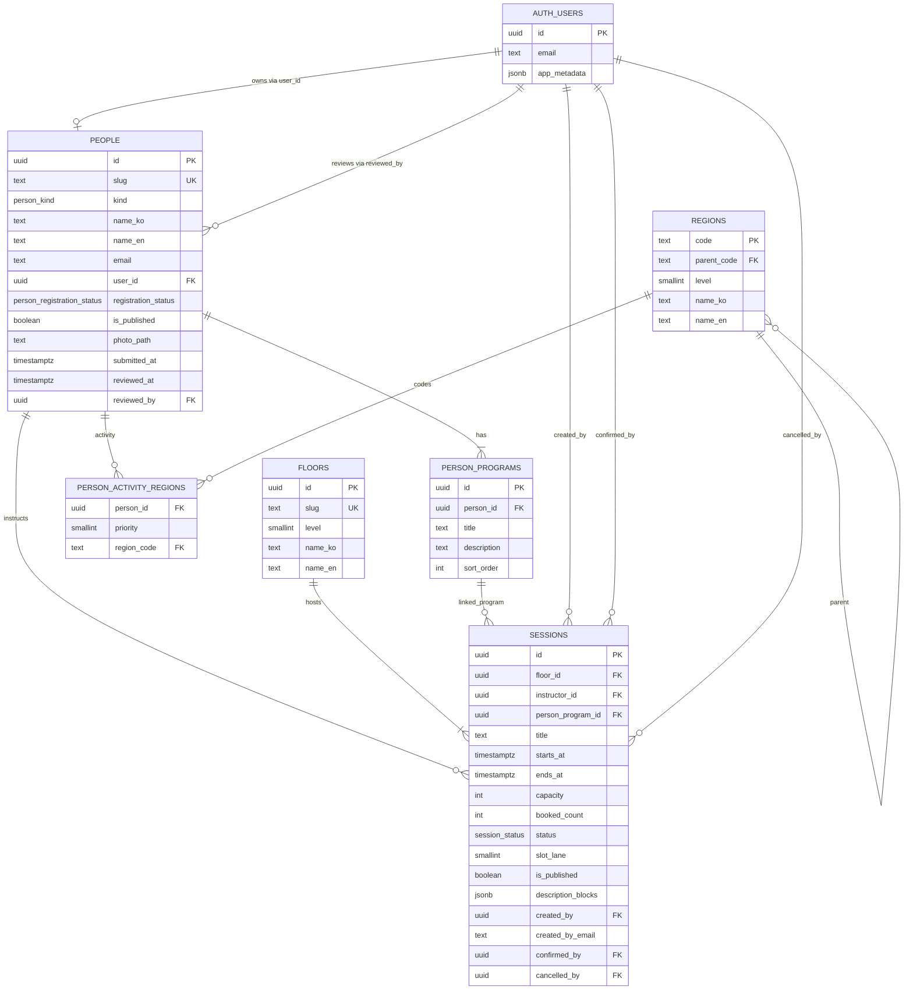
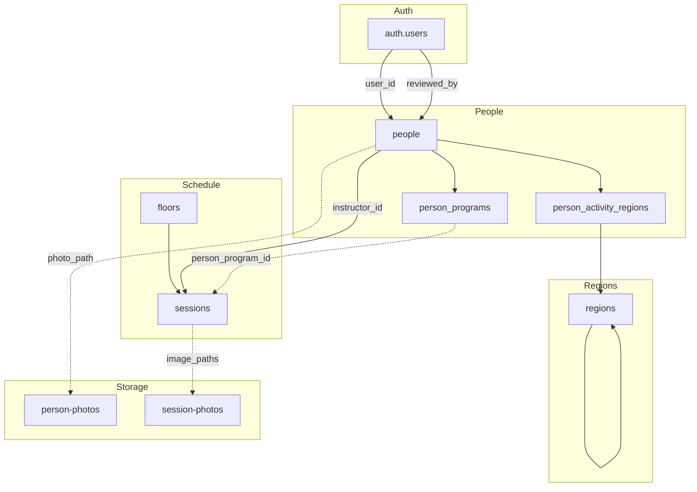
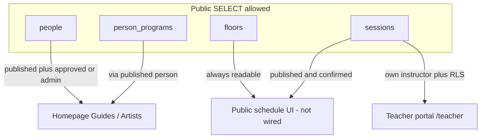

# The Wellness Korea — Database ERD

Last updated: 2026-06-16

Companion: [Schema reference](./database-schema.md) · [Backend logic](./backend-architecture.md) · [Site map](./site-map-and-flows.md) · [Audit log](./architecture-audit-log.md)

> 목적: 데이터 간 관계 시각화

---

## Entity relationship diagram

> `path_keys` (enum array) on `PERSON_PROGRAMS` and `SESSIONS` omitted from diagram for readability. See [database-schema.md](./database-schema.md).

---

## Relationship table

| From | To | Cardinality | ON DELETE | Notes |
|------|-----|-------------|-----------|-------|
| `people.user_id` | `auth.users` | 0..1 : 1 | SET NULL | At most one person per auth user |
| `people.reviewed_by` | `auth.users` | N : 1 | — | Reviewing admin |
| `person_programs.person_id` | `people` | N : 1 | CASCADE | |
| `person_activity_regions.person_id` | `people` | N : 1 | CASCADE | priority 1 or 2 per person |
| `person_activity_regions.region_code` | `regions` | N : 1 | RESTRICT | sigungu-level code |
| `regions.parent_code` | `regions` | N : 0..1 | RESTRICT | sido → null parent |
| `sessions.instructor_id` | `people` | N : 1 | RESTRICT | Blocks person delete |
| `sessions.floor_id` | `floors` | N : 1 | RESTRICT | |
| `sessions.person_program_id` | `person_programs` | N : 0..1 | SET NULL | Optional |
| `sessions.created_by` | `auth.users` | N : 1 | — | |
| `sessions.confirmed_by` | `auth.users` | N : 1 | — | |
| `sessions.cancelled_by` | `auth.users` | N : 1 | — | |

---

## Domain groupings

| Domain | Tables | Storage |
|--------|--------|---------|
| People | `people`, `person_programs` | `person-photos` |
| Schedule | `floors`, `sessions` | `session-photos` |
| Auth | `auth.users` (managed) | — |

---

## Enum usage

| Enum | Columns |
|------|---------|
| `person_kind` | `people.kind` |
| `path_key` | `person_programs.path_keys[]`, `sessions.path_keys[]` |
| `person_registration_status` | `people.registration_status` |
| `session_status` | `sessions.status` |

---

## Constraints (non-FK)

| Rule | Target |
|------|--------|
| `UNIQUE (lower(email))` where set | `people` |
| `UNIQUE (user_id)` where set | `people` |
| `ends_at > starts_at` | `sessions` |
| `cardinality(image_paths) <= 3` | `sessions` |
| `slot_lane BETWEEN 0 AND 1` | `sessions` |
| `level BETWEEN 1 AND 4` | `floors` |
| `capacity > 0`, `booked_count >= 0` | `sessions` |

---

## Public read paths

Anonymous (`anon`) and authenticated users can **SELECT** only through RLS policies below. Writes require admin session (or teacher own-row policies).

| Entity | Public read condition | Wired to UI |
|--------|----------------------|-------------|
| `people` | published + `admin`\|`approved` | ✓ homepage |
| `person_programs` | via published person | ✓ homepage cards |
| `floors` | always | ✗ (future schedule) |
| `sessions` | published + `confirmed` | ✓ teacher portal; ✗ homepage (mock) |
| Storage objects | bucket public flag | ✓ photo URLs |

**Teacher read:** own `people` + `person_programs` via `user_id = auth.uid()`; own `sessions` where confirmed + published (`/teacher` dashboard).

**Admin read/write:** all rows via `is_admin_user()` or authenticated session policies on floors/sessions.

---

## Storage (logical links)

| DB column | Bucket | Cardinality |
|-----------|--------|-------------|
| `people.photo_path` | `person-photos` | 0..1 |
| `sessions.image_paths` | `session-photos` | 0..3 |

No relational FK to `storage.objects`.
