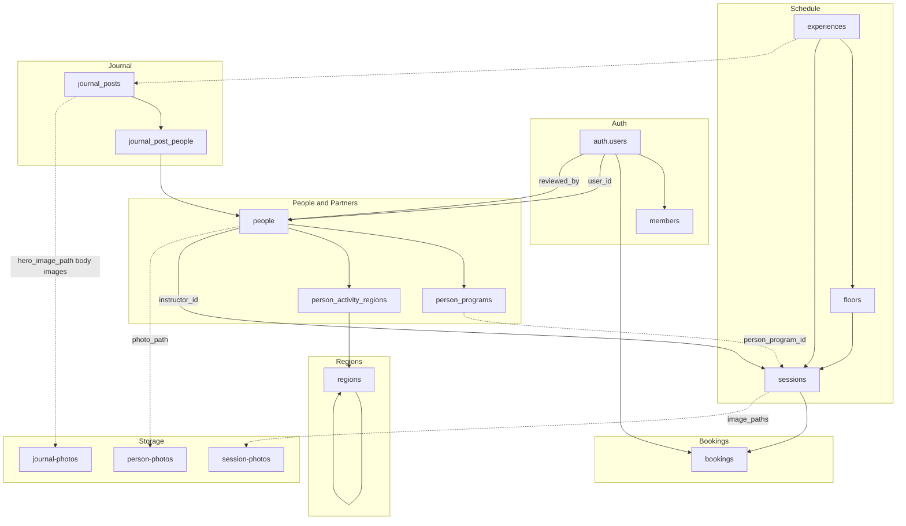

# The Wellness Korea — Database ERD

Last updated: 2026-06-17

Companion: [Schema reference](./database-schema.md) · [Backend logic](./backend-architecture.md) · [Site map](./site-map-and-flows.md) · [Multi-experience requirements](./multi-venue-requirements.md) · [Audit log](./architecture-audit-log.md)

> 목적: 데이터 간 관계 시각화

---

## Entity relationship diagram

```mermaid
erDiagram
    AUTH_USERS ||--o| PEOPLE : "owns via user_id"
    AUTH_USERS ||--o{ PEOPLE : "reviews via reviewed_by"
    AUTH_USERS ||--o| MEMBERS : "participant profile"
    AUTH_USERS ||--o{ SESSIONS : "created_by"
    AUTH_USERS ||--o{ SESSIONS : "confirmed_by"
    AUTH_USERS ||--o{ SESSIONS : "cancelled_by"
    AUTH_USERS ||--o{ BOOKINGS : "member booking"

    PEOPLE ||--|{ PERSON_PROGRAMS : "has"
    PEOPLE ||--o{ PERSON_ACTIVITY_REGIONS : "activity"
    PEOPLE ||--o{ SESSIONS : "instructs"
    PEOPLE ||--o{ JOURNAL_POST_PEOPLE : "tagged partner"

    REGIONS ||--o{ REGIONS : "parent"
    REGIONS ||--o{ PERSON_ACTIVITY_REGIONS : "codes"

    EXPERIENCES ||--|{ FLOORS : "has"
    EXPERIENCES ||--o{ SESSIONS : "hosts"
    EXPERIENCES ||--o{ JOURNAL_POSTS : "optional tag"

    FLOORS ||--|{ SESSIONS : "level"
    PERSON_PROGRAMS ||--o{ SESSIONS : "linked_program"
    SESSIONS ||--o{ BOOKINGS : "reservations"

    JOURNAL_POSTS ||--|{ JOURNAL_POST_PEOPLE : "partner tags"

    AUTH_USERS {
        uuid id PK
        text email
        jsonb app_metadata
    }

    MEMBERS {
        uuid id PK_FK
        text name
        text phone
        text locale
    }

    PEOPLE {
        uuid id PK
        text slug UK
        person_kind kind
        text name_ko
        text name_en
        text email
        uuid user_id FK
        person_registration_status registration_status
        boolean is_published
        text photo_path
        timestamptz submitted_at
        timestamptz reviewed_at
        uuid reviewed_by FK
    }

    PERSON_PROGRAMS {
        uuid id PK
        uuid person_id FK
        text title
        text description
        int sort_order
    }

    REGIONS {
        text code PK
        text parent_code FK
        smallint level
        text name_ko
        text name_en
    }

    PERSON_ACTIVITY_REGIONS {
        uuid person_id FK
        smallint priority
        text region_code FK
    }

    EXPERIENCES {
        uuid id PK
        text slug UK
        experience_kind kind
        text name_en
        boolean is_published
        boolean schedule_enabled
        int sort_order
    }

    FLOORS {
        uuid id PK
        uuid experience_id FK
        text slug
        smallint level
        text name_ko
        text name_en
    }

    SESSIONS {
        uuid id PK
        uuid experience_id FK
        uuid floor_id FK
        uuid instructor_id FK
        uuid person_program_id FK
        text title
        timestamptz starts_at
        timestamptz ends_at
        int capacity
        int booked_count
        session_status status
        smallint slot_lane
        boolean is_published
        jsonb description_blocks
        uuid created_by FK
        text created_by_email
        uuid confirmed_by FK
        uuid cancelled_by FK
    }

    BOOKINGS {
        uuid id PK
        uuid session_id FK
        uuid user_id FK
        text guest_name
        text guest_email
        text guest_phone
        booking_status status
        text cancel_token UK
        timestamptz cancelled_at
    }

    JOURNAL_POSTS {
        uuid id PK
        text slug UK
        text title_en
        text excerpt_en
        text body_en
        text hero_image_path
        journal_category category
        timestamptz published_at
        int read_minutes
        boolean is_published
        uuid experience_id FK
    }

    JOURNAL_POST_PEOPLE {
        uuid id PK
        uuid journal_post_id FK
        uuid person_id FK
        int sort_order
    }
```

> `path_keys` (enum array) on `PERSON_PROGRAMS` and `SESSIONS` omitted from diagram for readability. `body_en` stores sanitized TipTap HTML. See [database-schema.md](./database-schema.md).

---

## Relationship table

| From | To | Cardinality | ON DELETE | Notes |
|------|-----|-------------|-----------|-------|
| `people.user_id` | `auth.users` | 0..1 : 1 | SET NULL | At most one person per auth user |
| `people.reviewed_by` | `auth.users` | N : 1 | — | Reviewing admin |
| `members.id` | `auth.users` | 1 : 1 | CASCADE | Participant profile (role `member`) |
| `person_programs.person_id` | `people` | N : 1 | CASCADE | |
| `person_activity_regions.person_id` | `people` | N : 1 | CASCADE | priority 1 or 2 per person |
| `person_activity_regions.region_code` | `regions` | N : 1 | RESTRICT | sigungu-level code |
| `regions.parent_code` | `regions` | N : 0..1 | RESTRICT | sido → null parent |
| `experiences` | Space / Journey master; hero + schedule branch |
| `floors.experience_id` | `experiences` | N : 1 | RESTRICT | Unique (experience_id, slug/level) |
| `sessions.experience_id` | `experiences` | N : 1 | RESTRICT | Must match floor's experience (trigger) |
| `sessions.instructor_id` | `people` | N : 1 | RESTRICT | Blocks person delete |
| `sessions.floor_id` | `floors` | N : 1 | RESTRICT | |
| `sessions.person_program_id` | `person_programs` | N : 0..1 | SET NULL | Optional |
| `sessions.created_by` | `auth.users` | N : 1 | — | |
| `sessions.confirmed_by` | `auth.users` | N : 1 | — | |
| `sessions.cancelled_by` | `auth.users` | N : 1 | — | |
| `bookings.session_id` | `sessions` | N : 1 | RESTRICT | |
| `bookings.user_id` | `auth.users` | N : 0..1 | SET NULL | NULL = guest booking |
| `journal_posts.experience_id` | `experiences` | N : 0..1 | SET NULL | Optional Space/Journey tag |
| `journal_post_people.journal_post_id` | `journal_posts` | N : 1 | CASCADE | Partner footer tags |
| `journal_post_people.person_id` | `people` | N : 1 | CASCADE | Guide / Artist / Brand profile link |

---

## Domain groupings



| Domain | Tables | Storage |
|--------|--------|---------|
| People / Partners | `people`, `person_programs`, `person_activity_regions` | `person-photos` |
| Schedule | `experiences`, `floors`, `sessions` | `session-photos` |
| Bookings | `members`, `bookings` | — |
| Journal | `journal_posts`, `journal_post_people` | `journal-photos` |
| Auth | `auth.users` (managed), `members` | — |

---

## Enum usage

| Enum | Columns |
|------|---------|
| `person_kind` | `people.kind` — `wellness_guide`, `artist`, `brand` |
| `path_key` | `person_programs.path_keys[]`, `sessions.path_keys[]` |
| `person_registration_status` | `people.registration_status` |
| `session_status` | `sessions.status` |
| `experience_kind` | `experiences.kind` — `space`, `journey` |
| `booking_status` | `bookings.status` |
| `journal_category` | `journal_posts.category` |

---

## Constraints (non-FK)

| Rule | Target |
|------|--------|
| `UNIQUE (lower(email))` where set | `people` |
| `UNIQUE (user_id)` where set | `people` |
| `ends_at > starts_at` | `sessions` |
| `cardinality(image_paths) <= 3` | `sessions` |
| `slot_lane BETWEEN 0 AND 1` | `sessions` |
| `level BETWEEN 1 AND 99` | `floors` |
| `capacity > 0`, `booked_count >= 0` | `sessions` |
| `session.experience_id = floor.experience_id` | `sessions` (trigger `sessions_floor_experience_match`) |
| Unique active booking per session + email/user | `bookings` (partial indexes) |
| `UNIQUE (journal_post_id, person_id)` | `journal_post_people` |

---

## Public read paths

Anonymous (`anon`) and authenticated users can **SELECT** only through RLS policies below. Writes require admin session (or teacher own-row policies).


| Entity | Public read condition | Wired to UI |
|--------|----------------------|-------------|
| `people` | published + `admin`\|`approved` | ✓ homepage, `/people/[slug]` |
| `person_programs` | via published person | ✓ homepage cards |
| `person_activity_regions` | via published person | ✓ profile region display |
| `regions` | always | ✓ admin / apply region pickers |
| `experiences` | `is_published = true` | ✓ experience landing |
| `floors` | always | ✓ schedule (partial) |
| `sessions` | published + `confirmed` | ✓ teacher portal; homepage schedule |
| `journal_posts` | `is_published = true` | ✓ `/journal`, `/journal/[slug]` |
| `journal_post_people` | published post + published partner | ✓ journal footer partner cards |
| `members` | own row only (`id = auth.uid()`) | ✓ `/account/*` |
| `bookings` | own row only (`user_id = auth.uid()`) | ✓ `/account/bookings` |
| Storage objects | bucket public flag | ✓ photo URLs |

**Teacher read:** own `people` + `person_programs` + `person_activity_regions` via `user_id = auth.uid()`; own `sessions` where confirmed + published (`/teacher` dashboard).

**Admin read/write:** all app tables via `is_admin_user()` (`app_metadata.role = 'admin'`). Floors writes are admin-only (migration `018`).

**Guest booking:** insert via `create_booking` RPC (service role) — no direct anon INSERT on `bookings`.

---

## Storage (logical links)

| DB column | Bucket | Cardinality |
|-----------|--------|-------------|
| `people.photo_path` | `person-photos` | 0..1 |
| `sessions.image_paths` | `session-photos` | 0..3 |
| `journal_posts.hero_image_path` | `journal-photos` | 0..1 |
| inline body images | `journal-photos` | 0..N (`{postId}/inline/*`) |

No relational FK to `storage.objects`.
