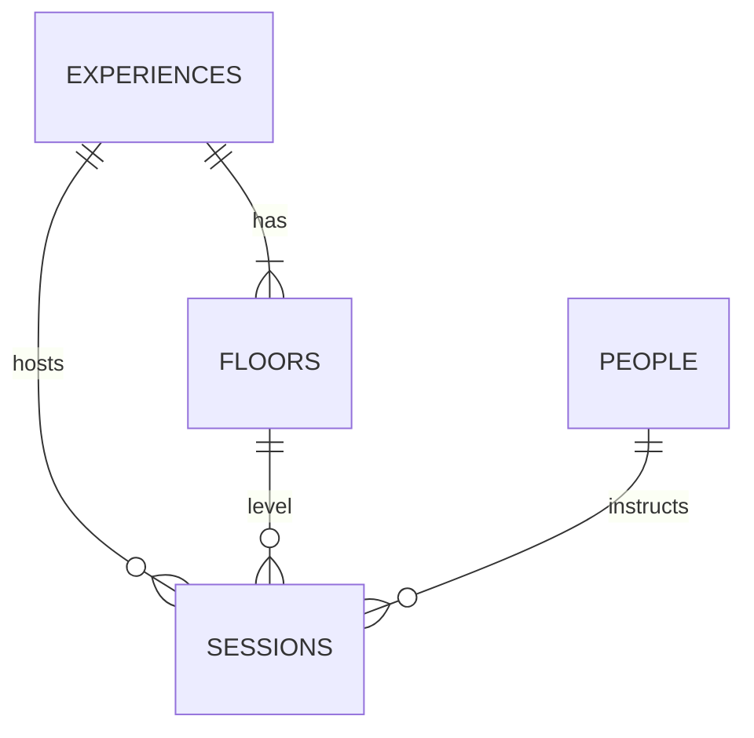

# Multi-Experience Platform — Requirements

Last updated: 2026-06-18

Companion: [Site map](./site-map-and-flows.md) · [DB schema](./database-schema.md) · [ERD](./database-erd.md) · [Backend](./backend-architecture.md)

> The Wellness Korea: **guides & artists** are the platform core; **Spaces** and **Journeys** are where experiences expand.

---

## 1. Product vision

| Layer | Role | Changes when adding a venue? |
|-------|------|------------------------------|
| **Platform** | Brand, philosophy, guides, artists, programs | No |
| **Experience** | A **Space** (long-term) or **Journey** (time-bound) | Yes — hero, schedule, admin branch |
| **Floor** | Levels inside one Space (e.g. Brickwell 1F–4F) | Per Space only |
| **Session** | Class at experience + floor + time | Tied to experience |

---

## 2. Terminology (confirmed)

### Public-facing (English)

| Term | Use when | Examples |
|------|----------|----------|
| **Space** | Long-term physical or recurring venue | Brickwell (Seochon) |
| **Journey** | Short-term retreat, festival, pop-up, seasonal program | Future retreat, festival |

### Internal (single entity)

One table: **`experiences`** with `kind: 'space' | 'journey'`.

- UI and copy say **Space** or **Journey** based on `kind`.
- Do **not** expose Venue / Project as user-facing terms.

---

## 3. Confirmed decisions

| # | Decision |
|---|----------|
| Eyebrow | **Fixed on frontend** per `kind` + experience slug (not free-form DB text) |
| Hero slides | **Brickwell + Coming soon** (minimum 2 slides); more added later |
| Hero ↔ Schedule | **Horizontal sync** — active slide index filters schedule section |
| Floors | **`experience_id` on `floors`** — each Space can have different floor count |
| Footer / Closing CTA | **Platform philosophy fixed** — not per experience |
| Instructor overlap | **Global** — same instructor cannot double-book across experiences (existing rule) |

---

## 4. Eyebrow copy (frontend constants)

```text
Space (Brickwell):     K-WELLNESS · Gyeongbokgung · Seochon · Seoul
Space (Coming soon):   K-WELLNESS · Next Space · Coming Soon
Journey (template):    K-WELLNESS · {name} · {region} · {city}
```

Implementation: `lib/experiences/copy.ts` — keyed by `slug` and `kind`.

---

## 5. User-facing requirements

### 5.1 Hero carousel

| ID | Requirement |
|----|-------------|
| H-01 | Full-viewport hero supports **horizontal swipe/drag** between experiences |
| H-02 | Eyebrow from **frontend constants** (see §4) |
| H-03 | Per slide: hero image, headline, description, primary CTA, optional secondary link |
| H-04 | Primary CTA scrolls to **schedule** filtered to active experience |
| H-05 | Coming soon slide: visible, **no live schedule**, CTA subdued or “Notify me” (TBD) |
| H-06 | Vertical page snap must not fight horizontal hero drag (touch axis handling) |

### 5.2 Schedule section

| ID | Requirement |
|----|-------------|
| S-01 | **Synced horizontally** with hero active index |
| S-02 | Brickwell: live sessions when `schedule_enabled` (Phase 3+: from DB) |
| S-03 | Coming soon: empty state / “Opening soon” |
| S-04 | Parallel Spaces/Journeys can run schedules independently |

### 5.3 Platform sections (unchanged)

Guides, Artists, Philosophy, Footer — **not** filtered by experience.

---

## 6. Admin requirements

```
[ Experience: Brickwell (Space) ▼ ]     ← top branch (matches hero sort_order)
    └── [ Floor: 1F | 2F | 3F | 4F ]
            └── week / day grid → sessions
```

| ID | Requirement |
|----|-------------|
| A-01 | Schedule admin: **experience picker** at top |
| A-02 | CRUD experiences: slug, kind, names, hero asset, sort, publish, schedule_enabled |
| A-03 | Sessions require `experience_id` + `floor_id` (floor belongs to experience) |
| A-04 | People / programs: **experience-agnostic** |

---

## 7. Data model (Phase 1)



### `experiences`

| Column | Purpose |
|--------|---------|
| `slug` | `brickwell`, `next-space`, … |
| `kind` | `space` \| `journey` |
| `name_en`, `name_ko` | Display name |
| `hero_image_path` | Public path or storage path |
| `headline_en`, `description_en` | Hero body copy |
| `secondary_link_label_en`, `secondary_link_href` | Optional hero link |
| `sort_order` | Hero carousel order |
| `is_published` | Show on site |
| `schedule_enabled` | Public schedule + booking |

### `floors` (changed)

- Add `experience_id` FK (required after migration)
- Unique: `(experience_id, slug)`, `(experience_id, level)`
- Level check relaxed (not globally 1–4 only)

### `sessions` (changed)

- Add `experience_id` FK (denormalized for queries; must match floor’s experience)

### Seed (011)

| slug | kind | schedule_enabled | Notes |
|------|------|------------------|-------|
| `brickwell` | space | true | Existing 1F–4F floors attached |
| `next-space` | space | false | Coming soon hero slide |

---

## 8. Implementation phases

| Phase | Scope | Status |
|-------|--------|--------|
| **1** | DB: `experiences`, `floors.experience_id`, `sessions.experience_id`, seed | **Done** (`011` applied) |
| **2** | Hero carousel + eyebrow constants + Coming soon slide + schedule horizontal sync | **Done** |
| **3** | Admin experience picker + session `experience_id` wiring | Pending |
| **4** | Public schedule from Supabase (replace mock) | **Done** (booking B1) |

---

## 9. Out of scope (v1)

- Per-experience footer / closing copy
- Journey-specific booking flows
- Experience admin CRUD UI (can seed via SQL until Phase 4)
- `experience-photos` storage bucket (reuse paths like `/kw-hero.png` initially)

---

## 10. Changelog

| Date | Notes |
|------|-------|
| 2026-06-16 | Initial requirements; Journey/Space terminology; decisions 1–6 confirmed |
| 2026-06-16 | Phase 1 migration `011_experiences.sql` |
| 2026-06-16 | Phase 2 hero carousel + schedule horizontal sync |
| 2026-06-18 | Phase 2 complete: swipe-only schedule panels, `lib/experiences/*`, Next.js image hostname fix, person-card photo fallback |
