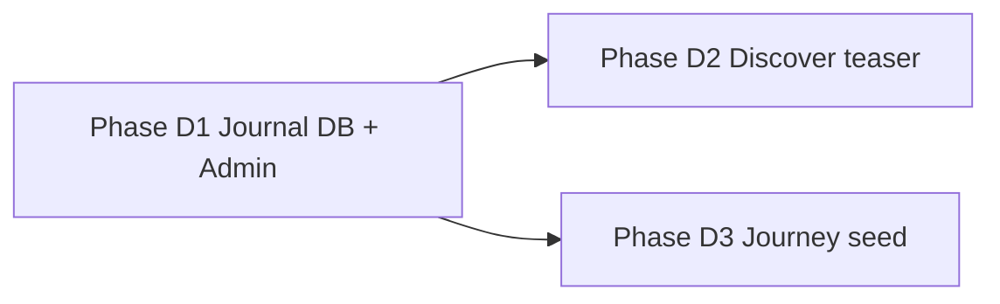

# Platform Core & Discover — Implementation Plan

Last updated: 2026-06-18

Companion: [Multi-experience](./multi-venue-requirements.md) · [Journal requirements](./journal-requirements.md) · [Site map](./site-map-and-flows.md) · [Backend](./backend-architecture.md)

> **Product frame:** Core Value (지역·F&B·웰니스 해석) is platform-wide and stable. Flexible Stage (Space, Journey, online channel) changes. Homepage stays focused on conversion; Core depth lives in Journal and Journey.

---

## 1. Product layers (confirmed)

| Layer | Korean | What it is | Changes? |
|-------|--------|------------|----------|
| **Core Value** | 본질 | Local tourism stories, F&B as wellness (season, ferment, region) | No |
| **Flexible Stage** | 가변 무대 | Offline Space (Brickwell), Journey (retreat), online platform | Yes |

### Core → product surfaces

| Core pillar | Primary surface | Secondary |
|-------------|-----------------|-----------|
| Local tourism | Journal `region` · Journey (`experiences.kind = journey`) | Guide `activity_regions` |
| Local F&B | Journal `taste` | Philosophy copy · future partner stories in Space |

### Flexible Stage → product surfaces

| Stage | Surface today | Notes |
|-------|---------------|-------|
| Space (Brickwell) | Hero carousel · Schedule · Booking | `experiences` + `sessions` — live |
| Journey (retreat) | Hero slide (coming soon) | Same `experiences` table, `kind = journey` |
| Online | `/`, `/journal`, `/people/[slug]` | O2O loop later (account, re-book) |

**Pitch line (partners):** Brickwell is a **wellness showroom**, not a store — F&B brands co-author stories with Guides/Artists; online Journal extends offline visits.

---

## 2. Current codebase status

| Area | Status |
|------|--------|
| `/journal`, `/journal/[slug]` | UI + queries exist; **falls back to static posts** |
| `journal_posts` table | **Not migrated** (queries expect it) |
| Journal in Navbar / Footer | **Hidden** (deferred in J1) |
| Categories | `philosophy`, `space`, `programs`, `news` — **no `region` / `taste` yet** |
| Body rendering | TipTap HTML in `body_en`; `journalBodyToHtml` + DOMPurify on public article |
| Admin Journal CRUD | **None** |
| Homepage Discover teaser | **None** |
| Journey in DB | **Not seeded** (only Space rows in `011`) |

---

## 3. Implementation phases

### Phase D1 — Journal goes live (DB + admin + nav)

**Goal:** Editors can publish posts; public `/journal` reads from Supabase.

| # | Task | Files / area |
|---|------|----------------|
| D1-1 | Migration `014_journal_posts.sql`: enum category (+ `region`, `taste`), table, RLS, optional `journal-photos` bucket | `supabase/migrations/` |
| D1-2 | Extend `JournalCategory`, `copy.ts`, seed 2–3 posts (region + taste samples) in migration or admin | `lib/journal/` |
| D1-3 | Admin list `/admin/journal` | `app/admin/(dashboard)/journal/` |
| D1-4 | Admin create/edit form + Server Actions | `app/admin/journal/actions.ts`, `components/admin/journal-form.tsx` |
| D1-5 | Hero image upload (mirror session-photos pattern) | `lib/journal/images.ts` |
| D1-6 | Navbar **Journal** link; Footer **Discover → Journal** | `navbar.tsx`, `footer-link-columns.tsx` |
| D1-7 | Docs: schema, ERD, site-map, backend map, journal-requirements | `docs/*` |

**Exit criteria:** Admin publishes a `taste` post → visible on `/journal` with category filter → detail page renders body.

---

### Phase D2 — Homepage Discover teaser

**Goal:** Signal Core pillars without bloating homepage.

| # | Task | Files / area |
|---|------|----------------|
| D2-1 | `DiscoverTeaser` section: 2 cards (Regional Journeys · Local Taste) | `components/discover-teaser.tsx` |
| D2-2 | Insert after `Artists`, before `Schedule` on `/` | `app/page.tsx` |
| D2-3 | Cards link to `/journal?category=region` and `/journal?category=taste` | `journal-index.tsx` reads `searchParams` |
| D2-4 | Optional: show latest published post per category on cards | `lib/journal/queries.ts` |

**Exit criteria:** Homepage shows slim teaser; clicks land on filtered Journal index.

---

### Phase D3 — Journey on Hero

**Goal:** Flexible Stage for regional retreat (even as Coming soon).

| # | Task | Files / area |
|---|------|----------------|
| D3-1 | Migration seed: one `journey` experience (e.g. `jeju-retreat`, `schedule_enabled = false`) | `015_journey_seed.sql` or extend admin experiences |
| D3-2 | Eyebrow copy in `lib/experiences/copy.ts` for Journey template | existing constants |
| D3-3 | (Optional) Admin CRUD for experiences if not yet built | defer if seed-only is enough |

**Exit criteria:** Hero carousel shows Brickwell + Next Space + Journey slide; schedule panel shows empty state for Journey.

---

### Phase D4 — Partners & O2O (later)

**Not in first sprint.**

| Option | When |
|--------|------|
| Journal posts tagged with partner name + external link | First F&B pilots |
| `partners` table (`kind: fnb \| stay \| craft`) + `/discover/partners` | 10+ partners |
| Commerce / booking on Journey | Product decision |

---

## 4. Journal input — how editors publish

### Decision: **Admin CRUD + Markdown body** (recommended)

Aligns with existing People / Schedule admin pattern. No third-party CMS in v1.

```
Admin /journal → New post → form → saveSession-style Server Action → journal_posts
Public /journal → Supabase read (RLS: published only)
```

### Why not alternatives (v1)

| Approach | Verdict |
|----------|---------|
| **Markdown in git (MDX)** | Good for devs; bad for non-technical editors; journal-requirements marks as non-primary |
| **Notion / Sanity / Contentful** | Extra cost, auth, sync; overkill for launch |
| **Supabase Studio manual SQL** | OK for one-off seed; not sustainable |
| **Rich block editor (TipTap etc.)** | Better UX later; v1 cost high — start with Markdown |

### Admin form fields (v1)

| Field | UI | Storage |
|-------|-----|---------|
| Title (EN) | text, required | `title_en` |
| Title (KO) | text, optional | `title_ko` |
| Slug | auto from title, editable | `slug` unique |
| Category | select | enum incl. `region`, `taste` |
| Excerpt | textarea | `excerpt_en` |
| Body | **TipTap WYSIWYG** (headings, quote, lists, link, inline image) | `body_en` HTML text |
| Hero image | file upload | `journal-photos` bucket → `hero_image_path` |
| Published at | date | `published_at` |
| Read minutes | number (auto-estimate optional) | `read_minutes` |
| Publish | toggle | `is_published` |
| SEO title / description | optional text | `seo_title`, `seo_description` |
| Experience link | optional select | `experience_id` FK (Journey/Space story) |

### TipTap body (public renderer)

- Admin: `components/admin/journal-editor.tsx` (TipTap StarterKit + Image + Link)
- Save: `sanitizeJournalHtml` in `saveJournalPost`
- Public: `journalBodyToHtml` in `journal-article.tsx` (legacy Markdown → HTML until `016` applied)

**Phase D1.5 (optional):** extend renderer for `###`, `-` lists, inline `**bold**`, or add `react-markdown` with allowlist.

### Authoring workflow

1. Admin → **Journal** → **New post**
2. Write in Markdown preview (optional split pane in D5)
3. Upload hero image
4. Save as draft (`is_published = false`) → preview via admin-only route **or** share slug after publish
5. Toggle **Publish** → live on `/journal` within revalidate window

### Preview before publish (D1 scope)

**Minimal:** Edit page shows excerpt + read-only body render below textarea (reuse `renderBody` extracted to shared util).

**Better (D5):** `/admin/journal/[id]/preview` with draft RLS policy for admins only.

### Images in body

**Done:** Hero + inline images via `journal-photos/{postId}/inline/{uuid}.*`; toolbar **Insert image** in TipTap.

### RLS

| Policy | Rule |
|--------|------|
| Public read | `is_published = true` |
| Admin all | `is_admin_user()` |

### Migration sketch (`journal_posts`)

```sql
create type public.journal_category as enum (
  'philosophy', 'space', 'programs', 'news', 'region', 'taste'
);

create table public.journal_posts (
  id uuid primary key default gen_random_uuid(),
  slug text not null unique,
  title_en text not null,
  title_ko text,
  excerpt_en text not null,
  body_en text not null default '',
  hero_image_path text,
  category public.journal_category not null default 'news',
  published_at timestamptz not null default now(),
  read_minutes int not null default 5 check (read_minutes > 0),
  is_published boolean not null default false,
  experience_id uuid references public.experiences(id) on delete set null,
  seo_title text,
  seo_description text,
  created_at timestamptz not null default now(),
  updated_at timestamptz not null default now()
);
```

---

## 5. Category map (Core alignment)

| Key | Label | Core pillar |
|-----|-------|-------------|
| `philosophy` | Philosophy | Platform |
| `space` | Space | Flexible Stage |
| `programs` | Programs | Guides / Artists |
| `news` | News | Platform |
| **`region`** | **Local Discovery** | **Core — tourism** |
| **`taste`** | **Local Taste** | **Core — F&B** |

Homepage Discover teaser uses **`region`** and **`taste`** only.

---

## 6. Suggested sprint order



| Sprint | Deliverable | Est. |
|--------|-------------|------|
| **Sprint 1** | D1 full (migration, admin, nav, 2 sample posts) | **Done** (2026-06-18) |
| **Sprint 2** | D2 teaser + journal URL category filter | 0.5–1 day |
| **Sprint 3** | D3 Journey hero seed + copy | 0.5 day |
| **Backlog** | D4 partners, rich editor, inline images, KO body | TBD |

---

## 7. Homepage section order (after D2)

```
Hero → Philosophy → Why Korea → Paths → Guides → Artists
  → Discover Teaser (NEW, slim)
  → Schedule → Closing CTA → Footer
```

Navbar adds **Journal** (no `#discover` anchor — separate route per journal-requirements).

---

## 8. Open decisions (confirm before Sprint 1)

| # | Question | Recommendation |
|---|----------|----------------|
| 1 | KO body field now? | **No** — `title_ko` only; EN body v1 |
| 2 | Draft preview URL for admin? | **Inline render on edit form** for v1 |
| 3 | Seed posts in migration vs admin manual? | **1–2 in migration** + rest via admin |
| 4 | `react-markdown` vs custom renderer? | **Keep custom** for D1; revisit if editors need lists/links |
| 5 | Journey seed name | Placeholder e.g. *Regional Journey · Coming soon* |

---

## 9. Changelog

| Date | Notes |
|------|-------|
| 2026-06-18 | Initial plan: Core/Flexible, D1–D4, Journal admin = Markdown + Supabase |
