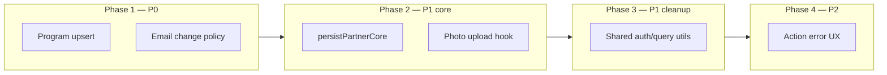

# Refactoring Plan — Code Duplication & Inefficiency

Last updated: 2026-06-16

Source: [Architecture Audit #1](./architecture-audit-log.md) §4–§6  
Companion: [Backend architecture](./backend-architecture.md) · [Database schema](./database-schema.md)

> 목적: Audit #1에서 식별한 P0–P2 항목에 대한 **요건 정의**, **설계 옵션**, **단계별 실행 계획**

---

## Overview



| Phase | 항목 | 예상 규모 | DB 마이그레이션 |
|-------|------|-----------|----------------|
| 1 | P0-A 프로그램 upsert | M | 없음 |
| 1 | P0-B 이메일 변경 정책 | S–M | 없음 |
| 2 | P1-A `persistPartnerCore` | L | 없음 |
| 2 | P1-B 폼 사진·submit 공통화 | M | 없음 |
| 3 | P1-C auth/query 유틸 | S | 없음 |
| 4 | P2 Server Action 에러 UX | S | 없음 |

**권장 순서:** P0-A → P0-B → P1-A → P1-B → P1-C → P2  
(P0-A가 세션 데이터 무결성에 직접 영향; P0-B는 운영 장애 해소)

---

## P0-A — Program upsert (세션 `partner_program_id` 보존)

### 현재 동작

```44:68:lib/people/persist.ts
export async function savePartnerPrograms(...) {
  await supabase.from("partner_programs").delete().eq("partner_id", personId)
  // ... insert all rows without id (new UUIDs every save)
}
```

- `PersonProgramFormInput`에 `id` 없음 → 폼이 DB UUID를 모름
- `program-list-editor`가 `key={index}` 사용
- `sessions.partner_program_id` FK: `ON DELETE SET NULL` → 프로그램 row 삭제 시 세션 링크 즉시 해제

### 문제 시나리오

| 행동 | 결과 |
|------|------|
| 어드민이 희주 선생님 프로필 저장 (프로그램 내용 동일) | 프로그램 UUID 전부 재발급 → 연결된 세션의 `partner_program_id` = NULL |
| 프로그램 1개 삭제 후 저장 | 해당 프로그램에 연결된 세션 링크 소실 (의도적일 수 있음) |
| 프로그램 순서만 변경 | UUID 유지 필요 → 현재는 불필요한 재생성 |

### 요건 (Functional)

| ID | 요건 |
|----|------|
| PRG-01 | 기존 프로그램 row의 `id`는 내용·순서 변경 시 **유지**한다 |
| PRG-02 | 폼에서 제거된 프로그램만 DB에서 DELETE 한다 |
| PRG-03 | 새로 추가된 프로그램만 INSERT 한다 (클라이언트 임시 id 또는 서버 생성) |
| PRG-04 | `title`, `description`, `path_keys`, `sort_order` 변경은 UPDATE 로 반영한다 |
| PRG-05 | 삭제된 프로그램을 참조하던 `sessions.partner_program_id`는 NULL 유지 (현재 FK 동작과 동일) |
| PRG-06 | admin 저장·teacher draft/submit **모두** 동일 `savePartnerPrograms` 경로 사용 |

### 요건 (Non-functional)

| ID | 요건 |
|----|------|
| PRG-N1 | 단일 person 저장은 1 SELECT + N UPDATE/INSERT/DELETE 이내 (기존 대비 쿼리 수 증가 허용) |
| PRG-N2 | DB 스키마 변경 없음 (마이그레이션 불필요) |
| PRG-N3 | 기존 세션 폼의 프로그램 드롭다운이 저장 후에도 동일 id로 선택 가능 |

### 설계

**1. 타입 확장**

```ts
export type PersonProgramFormInput = {
  id?: string          // 기존 row UUID; 신규는 undefined
  clientKey?: string   // 신규 프로그램 React key용 (저장 시 무시)
  title: string
  description: string
  path_keys: PathKey[]
}
```

**2. Upsert 알고리즘 (`savePartnerPrograms`)**

```
existing ← SELECT id FROM partner_programs WHERE partner_id = ?
incomingIds ← input.programs.map(p => p.id).filter(Boolean)

DELETE WHERE partner_id = ? AND id NOT IN incomingIds

FOR each program in input (with sort_order = index):
  IF program.id AND exists in existing:
    UPDATE ...
  ELSE:
    INSERT ... RETURNING id
```

**3. 폼 변경**

| 파일 | 변경 |
|------|------|
| `partner-form.tsx`, `teacher-profile-form.tsx` | `formFromPerson`에서 `id: p.id` 전달 |
| `program-list-editor.tsx` | `key={program.id ?? program.clientKey}`; 신규 추가 시 `clientKey: crypto.randomUUID()` |
| `savePartnerPrograms` | 위 upsert 로직 |

**4. 대안 (기각)**

| 옵션 | 기각 사유 |
|------|-----------|
| 세션만 `partner_program_id` 없이 title 매칭 복구 | 이름 변경 시 깨짐, 비결정적 |
| DB CASCADE로 프로그램 삭제 시 세션도 삭제 | 비즈니스적으로 과함 |
| PostgreSQL `ON CONFLICT` 단일 upsert | 클라이언트가 stable id를 보내야 함 → 위 설계와 동일 |

### 인수 조건 (Acceptance)

- [ ] 프로그램 제목만 수정 후 저장 → `partner_programs.id` 불변
- [ ] 동일 상태에서 재저장 → `sessions.partner_program_id` 유지
- [ ] 프로그램 삭제 → 해당 id 참조 세션만 `partner_program_id` NULL
- [ ] 신규 person 생성 + 프로그램 추가 → 정상 insert
- [ ] teacher `/apply/profile` draft/submit 경로 동일 동작

### 리스크

| 리스크 | 완화 |
|--------|------|
| 이미 NULL로 깨진 `partner_program_id` | 일회성 SQL로 수동 재연결 (선택); 자동 복구는 범위 외 |
| 동시 편집 race | 현재도 last-write-wins; 문서화만 |

---

## P0-B — 이메일 변경 충돌 (`maybeProvisionOnAdminSave`)

### 현재 동작

```71:98:lib/auth/teacher-account.ts
if (previousUserId && previousEmail && email changed) {
  await syncTeacherAuthEmail(previousUserId, email)  // 기존 teacher Auth UUID의 email만 변경
  return false
}
```

- 대상 이메일이 **다른 Auth 계정**에 이미 있으면 Supabase `updateUserById` 실패
- 프로덕션에서 Next.js가 메시지를 숨김 → 사용자는 digest 에러만 봄
- `provisionTeacherAccount`는 admin 이메일 충돌 시 명시적 에러 있음 (`role === "admin"`) — **이메일 변경 경로에는 없음**

### 문제 시나리오

| people.email 변경 | previousUserId | 결과 |
|-------------------|----------------|------|
| mudrasoil → jueeyipida | mudrasoil teacher uuid | **실패** — jueeyipida는 이미 admin Auth |
| mudrasoil → new@teacher.com | mudrasoil uuid | 성공 — Auth 이메일 rename |
| (동일) mudrasoil | mudrasoil uuid | 성공 — sync 스킵 |
| new person + email | null | `provisionAndEmailTeacherAccount` |

### 요건 (Functional)

| ID | 요건 |
|----|------|
| EM-01 | 이메일 변경 실패 시 **한국어/영어 가능한 명시적 메시지**를 클라이언트에 전달한다 |
| EM-02 | 대상 이메일이 **admin Auth**이면: teacher Auth rename **거부** (Option A) |
| EM-03 | 대상 이메일이 **다른 teacher Auth**이면: 거부 + "다른 계정에 연결됨" 안내 |
| EM-04 | 대상 이메일이 **미사용**이면: 기존 teacher Auth UUID의 email 업데이트 (현재 동작 유지) |
| EM-05 | `people.email` UNIQUE (`lower(email)`) 위반 시 DB 에러 전에 선검증 |
| EM-06 | 어드민/선생님 **역할 분리 원칙** 문서화: 한 이메일 = 한 역할 |

### 이메일 정책 — **Option A (Strict) ✅ 확정** (2026-06-16)

| 원칙 | 내용 |
|------|------|
| 1이메일 1역할 | 한 이메일은 admin **또는** teacher 중 하나만 |
| `people.email` 용도 | 선생님 **로그인·연락**용 (어드민 전용 필드) |
| admin 이메일 재사용 | `people.email`에 어드민 계정 이메일 설정 **금지** |
| 운영 분리 | 어드민: `jueeyipida@…` → `/admin` · 선생님: `mudrasoil@…` → `/teacher` |
| UI | 어드민 people 폼 이메일 필드에 helper text 표시 (구현 시) |

**기각된 대안**

| 옵션 | 상태 |
|------|------|
| B Relink (`user_id`를 admin으로 재연결) | 기각 |
| C `login_email` / `contact_email` 분리 | 장기 검토 (별도 epic) |

### 설계 (Option A — 구현 대상)

**새 함수:** `resolveEmailChangeOnAdminSave(params)`

```
1. if email unchanged → return { action: 'noop' }
2. existingAuth ← findUserByEmail(newEmail)  // service role
3. if existingAuth?.role !== 'teacher' (admin or unset):
     throw new UserFacingError('이 이메일은 어드민 계정에서 사용 중입니다. 선생님 연락처에는 다른 이메일을 사용하세요.')
4. if existingAuth && existingAuth.id !== previousUserId:
     throw new UserFacingError('이 이메일은 다른 선생님 계정에 연결되어 있습니다.')
5. if previousUserId:
     await syncTeacherAuthEmail(previousUserId, newEmail)
6. return { action: 'synced' }
```

**`maybeProvisionOnAdminSave` 변경:** step 2–5를 위 함수로 대체

### 인수 조건

- [ ] mudrasoil → jueeyipida 저장 시 명시적 에러 (프로덕션 포함)
- [ ] mudrasoil → unused@gmail.com 저장 시 Auth 이메일 변경 성공
- [ ] 이메일 불변 저장 시 부작용 없음
- [ ] `people.email` unique 위반 시 선제 메시지

### 리스크

| 리스크 | 완화 |
|--------|------|
| `findUserByEmail` O(n) | 사용자 수 적음; 추후 Supabase Admin API 개선 시 교체 |
| people.email ≠ auth.email 운영 혼란 | Admin UI에 "Teacher login" 필드 라벨 명확화 |

---

## P1-A — `savePartner` vs `persistTeacherProfile` 통합

### 현재 중복

| 단계 | `savePartner` | `persistTeacherProfile` |
|------|--------------|-------------------------|
| validate | `validatePersonInput` | 동일 |
| slug | `resolvePersonSlug` | 동일 |
| people row | `personRowFromInput` + admin 필드 | + `user_id`, `registration_status`, `submitted_at` |
| programs | `savePartnerPrograms` | 동일 |
| regions | `savePartnerActivityRegions` | 동일 |
| auth | `maybeProvisionOnAdminSave` | 없음 |
| notify | 없음 | `notifyAdminProfileSubmitted` |
| revalidate | admin paths + `/` | `/apply/profile`, `/admin/partners` |

공통 ~70줄, 분기 ~30줄.

### 요건

| ID | 요건 |
|----|------|
| PER-01 | 단일 `persistPartner(supabase, input, ctx)` — ctx로 admin/teacher 분기 |
| PER-02 | teacher 경로: `is_published` 항상 false, `user_id` = session user |
| PER-03 | admin 경로: publish guard, photo cleanup, provision 유지 |
| PER-04 | 기존 Server Action 시그니처 유지 (breaking change 없음) |
| PER-05 | revalidate는 caller(action)에서 ctx 기반 수행 |

### 설계

```ts
// lib/people/persist-partner.ts

type PersistPersonContext =
  | { mode: 'admin'; personId?: string; photoPath?: string | null; existing?: ExistingPersonMeta }
  | { mode: 'teacher'; person: PersonRow | null; userId: string; submit: boolean }

export async function persistPartner(
  supabase: SupabaseClient,
  input: PartnerFormInput,
  ctx: PersistPersonContext,
): Promise<{ personId: string; notify: boolean }>
```

- `app/admin/actions.ts` → `savePartner`은 thin wrapper
- `app/apply/actions.ts` → `persistTeacherProfile` 제거, wrapper만

### 인수 조건

- [ ] 기존 E2E 시나리오 회귀 없음 (admin CRUD, teacher draft/submit/approve)
- [ ] 공통 로직 한 파일에만 존재

### 선행 조건

- P0-A (`savePartnerPrograms` upsert) 완료 권장 — 통합 시 한 번만 테스트

---

## P1-B — `partner-form` / `teacher-profile-form` 사진·저장 중복

### 현재 중복 (~60줄 × 2)

| 블록 | partner-form | teacher-profile-form |
|------|-------------|----------------------|
| `onFileChange` | EN 메시지 | KO 메시지 |
| `uploadPhotoFile` | 동일 | 동일 |
| submit preamble | `personId`, `photoPath` | 동일 |
| `formFromPerson` | 거의 동일 | `is_published: false` 고정 |

### 요건

| ID | 요건 |
|----|------|
| FRM-01 | `uploadPersonPhoto(personId, file)` — `lib/people/photo-upload.ts` (client) |
| FRM-02 | `validatePersonPhotoFile(file)` — MIME/size 검증, locale 메시지는 caller |
| FRM-03 | `personInputFromRow(person, overrides?)` — `lib/people/form-state.ts` |
| FRM-04 | `usePersonPhotoState(initialPath?)` — file, preview, handlers (선택) |
| FRM-05 | UI 섹션(Kind, Basic, Programs)은 **통합하지 않음** — admin/teacher 레이아웃 차이 유지 |

### 설계

```
lib/people/
  photo-upload.ts      # uploadPersonPhoto, validatePersonPhotoFile
  form-state.ts        # personInputFromRow, defaultPersonInput

components/people/
  partner-photo-field.tsx  # optional: preview + file input UI
```

- submit orchestration은 P1-A 이후 action이 단순해지면 각 폼에 5–10줄만 유지

### 인수 조건

- [ ] `uploadPhotoFile` 구현이 한 곳뿐
- [ ] `formFromPerson` 중복 제거

---

## P1-C — `normalizeRelation`, `requireAuth`, upcoming sessions

### 1. `normalizeRelation`

**현재:** `lib/people/queries.ts`, `lib/schedule/queries.ts` 각각 동일 5줄

**요건:** `lib/supabase/normalize-relation.ts` export → 두 queries에서 import

**규모:** XS (30분)

### 2. `requireAuth`

**현재:**

| 위치 | 반환 |
|------|------|
| `admin/actions.ts` | `{ supabase, user }` |
| `schedule/actions.ts` | `{ supabase, userId, userEmail }` |
| `apply/actions.ts` | `requireTeacherAuth` + redirect `/apply` |

**요건:**

| ID | 요건 |
|----|------|
| AUTH-01 | `lib/auth/require-session.ts` — `requireAdminSession()`, `requireTeacherSession()` |
| AUTH-02 | redirect 경로 각각 유지 |
| AUTH-03 | schedule은 `userId`/`userEmail` 파생 |

**기각:** 단일 `requireAuth(role)` — redirect URL 분기가 오히려 복잡

### 3. Upcoming sessions

**현재:**

- `getUpcomingSessionsForInstructor(instructorId)` — public profile
- `getUpcomingSessionsForTeacher()` — teacher portal (user_id → people.id lookup)

**요건:**

```ts
// lib/schedule/queries.ts
getUpcomingSessions(
  filter: { instructorId: string } | { userId: string },
  limit?: number,
)
```

- teacher-queries.ts는 thin wrapper 또는 제거

### 인수 조건

- [ ] 동작 동일, 중복 제거
- [ ] import 경로만 변경, 페이지 동작 회귀 없음

---

## P2 — 프로덕션 Server Action 에러 메시지

### 현재

- Server Action `throw new Error("...")` → 프로덕션에서 generic digest 메시지
- Client `catch (err) => err.message` → digest 문자열 그대로 표시

### 요건

| ID | 요건 |
|----|------|
| ERR-01 | 사용자 입력/비즈니스 검증 실패는 **항상 읽을 수 있는 메시지** |
| ERR-02 | 내부/예상치 못한 오류는 generic + 로그 |
| ERR-03 | 민감 정보(DB stack, service role) 노출 금지 |

### 설계 옵션

**Option 1 — Result pattern (권장)**

```ts
type ActionResult<T> =
  | { ok: true; data: T }
  | { ok: false; error: string }

export async function savePartner(...): Promise<ActionResult<string>> {
  try {
    ...
    return { ok: true, data: personId }
  } catch (e) {
    if (e instanceof UserFacingError) return { ok: false, error: e.message }
    console.error(e)
    return { ok: false, error: '저장에 실패했습니다. 잠시 후 다시 시도해 주세요.' }
  }
}
```

- 폼: `const result = await savePartner(...); if (!result.ok) setError(result.error)`
- `UserFacingError` class in `lib/errors.ts`

**Option 2 — `useActionState` (React 19)**

- 동일 Result를 state로 — progressive enhancement
- 폼 리팩터 범위 큼

**Option 3 — `development` only 상세 메시지**

- 근본 해결 아님 → 보조만

**권장:** Option 1을 P0-B와 함께 `savePartner` / `maybeProvision`에 먼저 적용 → 점진 확대

### 인수 조건

- [ ] 프로덕션 빌드에서 이메일 충돌 시 한글 메시지 표시
- [ ] 예상치 못한 Supabase 오류 시 generic fallback

### 선행 조건

- P0-B (`UserFacingError` 도입)와 자연스럽게 결합

---

## 테스트 전략

| Phase | 테스트 |
|-------|--------|
| P0-A | 스크립트: person 저장 전후 `partner_programs.id`, `sessions.partner_program_id` 비교 |
| P0-B | 스크립트: email change 시나리오 4종 (unchanged, free, admin conflict, teacher conflict) |
| P1 | 기존 수동 체크리스트: admin people CRUD, apply flow, schedule program picker |
| P2 | prod build `next build && next start`에서 에러 메시지 육안 확인 |

자동화 테스트 파일 추가는 **요청 시** — 현재 repo에 people/schedule 통합 테스트 인프라 없음.

---

## 실행 체크리스트 (이력용)

| Step | 항목 | 상태 | 완료일 | PR/메모 |
|------|------|------|--------|---------|
| 1 | P0-A program upsert | done | 2026-06-16 | `savePartnerPrograms` upsert; form `id`/`clientKey` |
| 2 | P0-B email change policy (Option A) | done | 2026-06-16 | `lib/auth/teacher-email.ts` |
| 3 | P2 partial (UserFacingError + savePartner Result) | done | 2026-06-16 | `PartnerSaveResult` in `savePartner` |
| 4 | P1-A persistPartnerCore | done | 2026-06-16 | `lib/people/persist-partner.ts` |
| 5 | P1-B photo/form-state extract | done | 2026-06-16 | `photo-upload`, `form-state`, `PartnerPhotoField` |
| 6 | P1-C normalizeRelation, requireAuth, upcoming | done | 2026-06-16 | `require-session`, `getUpcomingSessions` |
| 7 | P2 full (all actions Result) | pending | | |

완료 시 [architecture-audit-log.md](./architecture-audit-log.md) Changelog에 반영.

---

## Open questions (결정 필요)

1. ~~**이메일 정책:** Option A(strict)~~ → **✅ 확정 (2026-06-16)**
2. **깨진 `partner_program_id` 복구:** 일회성 SQL 지원 여부 — 데이터 팀
3. **P1-A 범위:** `persistPartnerCore`를 P0 직후 할지, P1-B와 묶을지 — 개발 일정
4. **`modalities` deprecate:** program upsert 안정화 후 별도 ticket — Audit D-04
