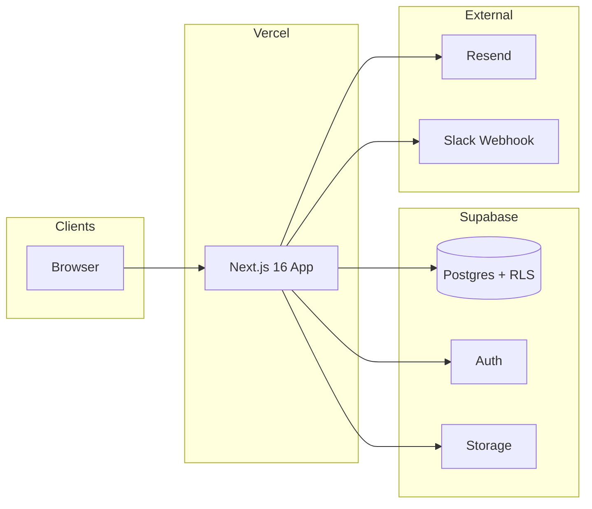

# The Wellness Korea — Site Map & Flows

Last updated: 2026-06-16

Companion docs: [Backend](./backend-architecture.md) · [DB schema](./database-schema.md) · [ERD](./database-erd.md)

> 목적: 전체 서비스의 지도 및 흐름 파악 (신규 개발자 온보딩용)

---

## Infrastructure overview



| Service | Role |
|---------|------|
| **Vercel** | Hosting, Production deploy, custom domain |
| **Supabase** | Postgres DB, Auth (admin password / teacher magic link), file storage |
| **Gabia DNS** | `thewellnesskorea.com` → Vercel |
| **Resend** | Admin email on teacher profile submit |
| **Slack** | Optional webhook alert (same event) |

### Domains

| URL | Role |
|-----|------|
| `https://thewellnesskorea.com` | Primary; 308 redirect to `www` (Vercel) |
| `https://www.thewellnesskorea.com` | Production site |
| `https://thewellnesskorea-tk77.vercel.app` | Vercel default (backup) |
| `http://localhost:3000` | Local dev |

**DNS (Gabia):** A `@` → `76.76.21.21` · CNAME `www` → `cname.vercel-dns.com.`

Public links, magic links, notification URLs → `NEXT_PUBLIC_SITE_URL`.

---

## Active URL map

모든 App Router 엔트리 (13 pages + 1 route handler).

| URL | File | Auth | Description |
|-----|------|------|-------------|
| `/` | `app/page.tsx` | Public | Homepage |
| `/apply` | `app/apply/page.tsx` | Public | Teacher invite + email |
| `/apply/check-email` | `app/apply/check-email/page.tsx` | Public | Magic link sent confirmation |
| `/apply/profile` | `app/apply/profile/page.tsx` | Teacher session | Profile create/edit |
| `/apply/profile/submitted` | `app/apply/profile/submitted/page.tsx` | Teacher session | Submit success |
| `/auth/callback` | `app/auth/callback/route.ts` | — | OAuth/magic-link code exchange |
| `/admin/login` | `app/admin/login/page.tsx` | Public | Admin email + password |
| `/admin` | `app/admin/(dashboard)/page.tsx` | Admin | → redirect `/admin/people` |
| `/admin/people` | `app/admin/(dashboard)/people/page.tsx` | Admin | People list |
| `/admin/people/new` | `app/admin/(dashboard)/people/new/page.tsx` | Admin | Manual person create |
| `/admin/people/[id]/edit` | `app/admin/(dashboard)/people/[id]/edit/page.tsx` | Admin | Edit + review panel |
| `/admin/schedule` | `app/admin/(dashboard)/schedule/page.tsx` | Admin | Schedule admin |

**Homepage anchors (same page):** `/#guides` · `/#artists` · `/#schedule`

**Schedule admin query params:** `date` (YYYY-MM-DD) · `floor` (floor slug) · `view` (`week` \| `day` \| `month`)

**Middleware matcher:** `/admin/*`, `/apply/profile/*`, `/auth/callback` only. `/` and `/apply` are unguarded.

---

## Screen & component hierarchy

### Layout tree

```
app/layout.tsx                    ← root: fonts, metadata, Analytics
├── /                             app/page.tsx
├── /apply/*                      (no nested layout)
├── /auth/callback                route handler
└── /admin/login                  app/admin/login/page.tsx
    └── /admin/(dashboard)/*      app/admin/(dashboard)/layout.tsx
        ├── /admin/people
        ├── /admin/people/new
        ├── /admin/people/[id]/edit
        └── /admin/schedule
```

### Public homepage (`/`)

```
page.tsx
├── Navbar
├── Hero
├── Philosophy
├── WhyKorea
├── Paths
│   ├── path-section
│   └── path-card
├── Guides          ← getPublishedPeople("guide")
│   ├── person-section
│   └── person-card
├── Artists         ← getPublishedPeople("artist")
├── Schedule        ← mock data (components/schedule/*)
│   ├── schedule-section
│   ├── week-date-strip
│   ├── category-filters
│   └── class-list / class-card
├── ClosingCta
└── Footer
    ├── footer-brand-column
    ├── footer-link-columns
    ├── footer-social-links
    └── footer-bottom-bar
```

### Teacher apply (`/apply`)

| Screen | Components |
|--------|------------|
| `/apply` | `apply-login-form` |
| `/apply/check-email` | inline confirmation UI |
| `/apply/profile` | `teacher-profile-form` (+ shared `program-list-editor`, `philosophy-path-picker`) |
| `/apply/profile/submitted` | inline success UI |

### Admin dashboard

| Screen | Components |
|--------|------------|
| Layout | nav: People · Schedule · View site · Sign out |
| `/admin/people` | `admin-people-list` (search, status/path filters, apply link) |
| `/admin/people/new` | `person-form`, `program-list-editor` |
| `/admin/people/[id]/edit` | `person-form`, `person-review-panel`, `delete-person-button` |
| `/admin/schedule` | `schedule-admin-client` |
| | → `schedule-floor-nav`, `schedule-week-grid` / `schedule-day-grid` / `schedule-month-calendar` |
| | → `schedule-session-block`, `session-form-dialog`, `session-description-fields`, `session-image-upload`, `instructor-search-picker` |

---

## User flows

### Flow A — Visitor (public)

```
/ → Guides / Artists (DB: published + approved/admin only)
  → #schedule (mock; live sessions not wired)
```

### Flow B — Admin: manual person

```
/admin/login → /admin/people → /admin/people/new
  → Save (registration_status = admin)
  → Publish optional (no approval required)
```

### Flow C — Teacher self-registration

```
/apply → code + email → /apply/check-email
  → magic link → /auth/callback?next=/apply/profile
  → /apply/profile (linkTeacherPerson by email if exists)
  → [임시 저장] draft | [제출하기] submitted + admin notify
  → /apply/profile/submitted
```

Post-approval re-edit → `submitted`, unpublish, re-notify admins.

### Flow D — Admin: review teacher

```
/admin/people (filter: Pending / Self-registered)
  → /admin/people/[id]/edit → 승인 | 반려
  → Publish when admin or approved
```

### Flow E — Admin: schedule

```
/admin/schedule → click slot → create (processing, 50% width)
  → max 2 processing per floor+overlap bucket
  → Confirm → confirmed (100%), competitors cancelled
  → Publish when confirmed → revalidate /
```

---

## Domain enums (UI reference)

### Person `registration_status`

| Status | Homepage visible |
|--------|------------------|
| `admin` | Only if `is_published` |
| `draft` | No |
| `submitted` | No |
| `approved` | Only if `is_published` |
| `rejected` | No |

### Session `status`

| Status | Admin grid |
|--------|------------|
| `processing` | 50% width, amber ribbon |
| `confirmed` | 100% width, blue ribbon; publishable |
| `cancelled` | Hidden |

---

## Environment variables

기준: `.env.local.example`. **시크릿 값은 문서·커밋에 포함하지 않음.**

| Variable | Scope | Purpose |
|----------|-------|---------|
| `NEXT_PUBLIC_SUPABASE_URL` | client + server | Supabase project URL |
| `NEXT_PUBLIC_SUPABASE_ANON_KEY` | client + server | Anon key (RLS-bound) |
| `SUPABASE_SERVICE_ROLE_KEY` | server only | Auth admin API, admin email discovery |
| `NEXT_PUBLIC_SITE_URL` | client + server | Magic link redirect, notification links |
| `TEACHER_APPLY_CODE` | server | Teacher invite gate (default `twk2026`) |
| `RESEND_API_KEY` | server | Profile submit email |
| `NOTIFY_FROM_EMAIL` | server | Resend from address |
| `SLACK_WEBHOOK_URL` | server | Optional Slack alert |

**Production:** same keys; `NEXT_PUBLIC_SITE_URL` = `https://thewellnesskorea.com`.

Admin notify recipients: all Supabase Auth users where `app_metadata.role !== "teacher"` (no fixed env email).

**Supabase Auth redirect URLs:**

```
https://thewellnesskorea.com/auth/callback
https://www.thewellnesskorea.com/auth/callback
http://localhost:3000/auth/callback
```

**Scripts (optional, not in .env.example):** `ADMIN_EMAIL`, `ADMIN_PASSWORD` for `npm run create-admin`.

---

## Deployment checklist

- [ ] Gabia DNS: A + CNAME
- [ ] Vercel Domains: Valid (`thewellnesskorea.com`, `www`)
- [ ] Vercel env vars + Redeploy
- [ ] Supabase migrations `001`–`007` applied (`007` preferred over `006`)
- [ ] Supabase redirect URLs
- [ ] Resend: verify domain for multi-admin production email

---

## Source index

| Area | Path |
|------|------|
| Teacher apply | `app/apply/`, `components/apply/` |
| Auth callback | `app/auth/callback/route.ts` |
| Middleware | `middleware.ts`, `lib/supabase/middleware.ts` |
| Admin people | `app/admin/(dashboard)/people/`, `app/admin/actions.ts` |
| Admin schedule | `app/admin/(dashboard)/schedule/`, `app/admin/schedule/actions.ts` |
| Notifications | `lib/notifications/` |
| Migrations | `supabase/migrations/` |

---

## Not yet implemented

- Public `#schedule` from live `sessions` (still `components/schedule/schedule-data.ts` mock)
- Participant booking
- Resend verified domain for production multi-recipient delivery
